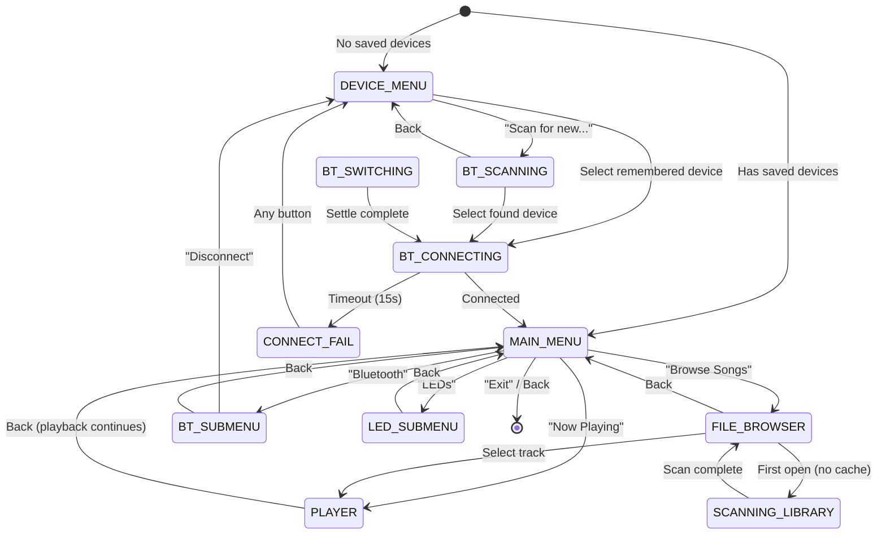

# Music Player Architecture

The Music Player app turns the Cyber Fidget into a portable Bluetooth music player. It reads MP3 files from the SD card, decodes them on the ESP32, and streams audio over BT Classic A2DP to a wireless speaker or headphones.

---

## What is this?

Think of it like an iPod that connects to a Bluetooth speaker:

1. **Pair** with a BT speaker (scan or pick a remembered device)
2. **Browse** your music library with ID3 metadata (artist, title)
3. **Play** — the ESP32 decodes MP3 in real-time and streams it over Bluetooth
4. **Control** — play/pause, next/prev, shuffle, volume via the physical slider

The player UI runs on the 128x64 OLED with a menu system inspired by the classic iPod click wheel navigation.

---

## State machine

The player has 11 states, navigated with Up/Down/Enter/Back:



!!! tip "Back from Now Playing keeps playing"
    Pressing Back in the player screen returns to the main menu but **doesn't stop playback**. Music keeps streaming in the background. This matches the iPod behavior — you can browse while listening.

---

## Audio pipeline

The audio chain is built from the [arduino-audio-tools](https://github.com/pschatzmann/arduino-audio-tools) library:

```
SD Card (SPI)
    │
    ▼
AudioSourceIdxSD ── scans /music/*.mp3, builds file index
    │
    ▼
AudioPlayer ── manages playback state, drives the pipeline
    │
    ▼
MP3DecoderHelix ── real-time MP3 decoding (libhelix, runs in IRAM)
    │
    ▼
SpectrumAnalyzer ── passthrough providing volumeRatio() + 16-band FFT
    │
    ▼
A2DPStream ── BT Classic A2DP Source → wireless speaker
```

The pipeline is driven by calling `pPlayer->copy()` every `update()` cycle (~50Hz). Each call reads a chunk from SD, decodes MP3 frames, and writes PCM samples to the A2DP buffer. The BT stack's internal callback drains the buffer and transmits over the air.

The `SpectrumAnalyzer` is a custom `ModifyingStream` that replaced the original `VolumeMeter`. It provides both `volumeRatio()` (0.0–1.0 peak amplitude) for LED reactive effects and `bands()[16]` (16-band FFT frequency spectrum) for the OLED visualizer. Audio passes through unchanged — zero latency, zero quality impact. See [LED Effects & Visualizer](led-effects.md) for details.

!!! warning "Pipeline objects are never destroyed"
    The A2DPStream, AudioPlayer, and AudioSourceIdxSD are heap-allocated once and kept alive for the entire app lifetime. Deleting them after active playback causes crashes due to internal FreeRTOS tasks and ring buffers that can't be cleanly shut down. See the [BT A2DP Guide](bt-a2dp-guide.md) for details.

### Volume control

The physical slider maps to A2DP volume (0-100%). The mapping is inverted: slider fully extended = 0%, fully retracted = 100%. This is updated every `update()` cycle via `updateVolumeFromSlider()`.

### AVRCP media controls (BT speaker buttons)

Many Bluetooth speakers and headphones have physical media buttons (play/pause, next, previous). These send **AVRCP passthrough commands** back to the audio source. The CyberFidget handles these commands so you can control playback from your BT device.

The ESP32 runs dual AVRCP roles simultaneously:

- **AVRCP Controller (CT)**: Sends commands *to* the speaker (existing, used for volume)
- **AVRCP Target (TG)**: Receives commands *from* the speaker (added in Phase 4.3)

Supported commands:

| Button | AVRCP Key Code | Action |
|--------|---------------|--------|
| Play | `ESP_AVRC_PT_CMD_PLAY` (0x44) | Toggle play/pause |
| Pause | `ESP_AVRC_PT_CMD_PAUSE` (0x46) | Toggle play/pause |
| Stop | `ESP_AVRC_PT_CMD_STOP` (0x45) | Stop playback |
| Next | `ESP_AVRC_PT_CMD_FORWARD` (0x4B) | Next track |
| Previous | `ESP_AVRC_PT_CMD_BACKWARD` (0x4C) | Previous track |

!!! note "Thread safety"
    AVRCP callbacks fire from the BTC FreeRTOS task, not the main Arduino loop. The callback sets a `volatile uint8_t pendingAvrcCmd` flag, which is consumed and dispatched in `update()`. This avoids cross-task race conditions on audio pipeline state.

!!! note "Speaker compatibility"
    Not all BT speakers send AVRCP commands when buttons are pressed. Some only support A2DP audio without AVRCP at all. The feature is additive — if the speaker doesn't send commands, nothing happens and physical CyberFidget buttons still work normally.

---

## BT device management

### Scanning

The `BTScanner` class uses raw ESP-IDF GAP APIs (`esp_bt_gap_start_discovery()`) to find nearby Bluetooth audio devices. Results are filtered by Class of Device (COD) — specifically `ESP_BT_COD_SRVC_RENDERING` which indicates audio sink capability.

Scan results show device names with signal strength bars (based on RSSI).

### Remembered devices

Up to 8 paired devices are stored in NVS (Non-Volatile Storage) using the ESP32's `Preferences` library:

- Namespace: `"btdevs"`
- Keys: `"count"`, `"d0n"`..`"d7n"` (names), `"d0a"`..`"d7a"` (6-byte BT addresses)

On app launch, if remembered devices exist, the player goes straight to the main menu and auto-reconnects to the last used device in the background.

### Device switching

Switching from Speaker A to Speaker B requires a careful two-phase process:

1. **Phase 1**: Disconnect current device, poll until `isConnected()` returns false (3s timeout)
2. **Phase 2**: 1 second settle time for BT stack cleanup
3. **Reconnect**: Restore buffer timeouts, call `reconnect()`, enter connecting state

A "Switching..." animation plays during this process.

---

## ID3 metadata

### Library scan

On first browse, the app scans all MP3 files for ID3 tags. It checks both formats:

- **ID3v2** (at file start): Parse header, look for TIT2 (title) and TPE1 (artist) frames
- **ID3v1** (last 128 bytes): Check for "TAG" header, extract fixed-width title/artist fields

Results are cached to `/music.idx` on the SD card. Subsequent opens load from cache unless the file count changes.

### Now Playing metadata

During playback, the AudioPlayer fires a metadata callback that captures title and artist from the MP3 stream headers. This updates the Now Playing display in real-time.

---

## Player UI layout

The Now Playing screen on the 128x64 OLED:

```
┌────────────────────────────┐
│  ⚡ Now Playing        87 ▊│  ← Header: BT icon (x=5), battery outline (right-aligned)
│ The Artist Name            │  ← Artist (y=8)
│ ♫ Track Title Here ←scroll │  ← Title with marquee (y=19)
│                            │
│ ▶ Playing          [S]     │  ← Status + shuffle indicator (y=31)
│ 1:23 ████████░░░░░ -2:58   │  ← Playhead with elapsed/remaining time (y=50)
└────────────────────────────┘
```

- **Battery**: Programmatic outline with percentage text inside. Lightning bolt icon when charging.
- **Marquee**: Long track titles scroll horizontally.
- **Playhead**: Progress bar with elapsed (M:SS) and remaining (-M:SS) time. Time estimated from MP3 bitrate read from the first MPEG frame header.
- **Volume overlay**: When the physical slider is moved, the playhead temporarily shows a volume bar for 2 seconds, then fades back to the playhead.
- **Visualizer**: When enabled (Up/Down toggle), a 16-bar amplitude graph replaces the playhead. See [LED Effects & Visualizer](led-effects.md).

---

## Scrubbing (seek within track)

Hold the left or right button for 500ms to start scrubbing backward or forward within the current track. The player seeks ~5 seconds worth of MP3 data every 200ms while the button is held.

Tap (quick press and release < 500ms) still triggers previous/next track.

The seek uses the Arduino SD `File::seek()` on the underlying stream (`pPlayer->getStream()` cast to `File*`). The MP3 decoder re-syncs automatically after the jump — there may be a brief audio artifact (~50ms) at the seek point.

---

## Resume playback

The player remembers your position when you pause or exit the app. On re-entry, selecting "Now Playing" from the main menu resumes the saved track at the saved byte position.

Resume state is stored in NVS (`"mpstate"` namespace) with the file path and byte offset. It's cleared when you start a new track.

---

## Sleep prevention

The firmware's power manager puts the device to sleep after 60 seconds of inactivity. During music playback, the app resets the interaction timer every update cycle:

```cpp
if (isPlaying) {
    millis_APP_LASTINTERACTION = millis_NOW;
}
```

This keeps the device awake as long as music is playing, without requiring any button interaction.

---

## File structure

```
lib/MusicPlayerApp/
├── MusicPlayerApp.h      — Class definition, state enum, all members
├── MusicPlayerApp.cpp    — State machine, audio pipeline, UI rendering (~1600 lines)
├── BTScanner.h / .cpp    — ESP-IDF GAP Bluetooth scanner
└── ID3Scanner.h / .cpp   — ID3v1/v2 metadata reader + SD cache
```
