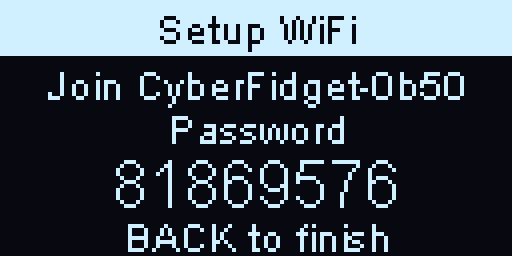

# Web Portal

The Web Portal turns the CyberFidget into a WiFi access point with a captive portal, giving you a browser-based interface to manage music files, create playlists, and preview tracks — all from your phone. It can also join your home WiFi network for easy access at `cyberfidget.local`.

---

## What is this?

Connect your phone to your Fidget's own WiFi network (named `CyberFidget-` plus 4 characters, shown on its screen) and a web portal opens automatically (captive portal). No app installs, no IP addresses to remember. From there you can:

1. **Upload** MP3 files via drag-and-drop
2. **Browse** your music library with real ID3 metadata (title, artist, album)
3. **Play** tracks through your phone's speaker (web audio)
4. **Manage** files — move, delete, create folders
5. **Build playlists** in M3U format that persist on the SD card
6. **Connect to WiFi** -- save up to three networks (home, school, a phone hotspot) for check-ins, updates, and `cyberfidget.local` access

### The portal's WiFi password

Each Fidget's network has its own name: `CyberFidget-` followed by 4 characters, for example `CyberFidget-0b50`. The Fidget's screen shows it after **Join** (for example **Join CyberFidget-0b50**). The 4 characters are the same ones the website shows for that Fidget (in **Your Fidgets**, for example), so with several Fidgets in one room each phone joins the right one.

The network has a password, so nobody nearby can join it without seeing your Fidget. The Fidget's screen shows it under the **Join** line, after **Password**:

- It is **8 digits** with no space (for example `12345678`). Type them exactly as shown.
- It is **new every time the portal starts**. A phone that joined last time will not reconnect by itself; type the new digits shown now.
- It stays on the screen while the portal runs. A live caption session takes over the screen while it is connected; the password comes back when the session ends.
- The Fidget does not save it anywhere. It is gone when you exit the portal.

---

## How it works

```
Phone → Connects to "CyberFidget-xxxx" WiFi AP (xxxx = 4 characters on the screen)
     → Captive portal auto-opens browser at 192.168.4.1
     → SPA loads (HTML/CSS/JS served from ESP32 flash)
     → API calls read/write files on the SD card
     → Audio served directly from SD over HTTP
```

Or, if connected to your home WiFi:

```
Phone → Same WiFi network as CyberFidget
     → Browse to http://cyberfidget.local
     → Same portal, no WiFi switching needed
```

The portal is a standalone app launched from the main menu under **Tools > CyberFidget Portal**. **Settings > Setup WiFi** opens the same portal straight on its WiFi page (see [Setting up WiFi](#setting-up-wifi)). It stops Bluetooth (shared radio) and starts WiFi, so you can't play music through a BT speaker while the portal is running.

To leave the portal, press the Back button. The device asks "Exit portal?" -- Enter confirms, Back cancels -- and then **restarts**. The restart is quick: the boot animation is skipped for this one restart, so you're back at the menu in a moment.

Why restart? The portal borrows resources to give the web features room to run -- including the memory normally reserved for the Bluetooth radio. Restarting is the clean way to hand everything back, so Bluetooth audio and every other feature start fresh. This also means Bluetooth audio (Music Player) is unavailable from the moment you open the portal until that exit restart completes.

!!! warning "WiFi and Bluetooth share the ESP32 radio"
    The ESP32 can't run WiFi AP and BT A2DP simultaneously with enough bandwidth for audio streaming. The portal calls `btStop()` on entry and releases the BT controller's memory to make room for the WiFi stack and web server. That memory can only be reclaimed cleanly by a restart, which is why exiting the portal restarts the device. After the restart, BT reconnects as usual when you open the Music Player.

---

## Architecture

### App lifecycle

```
Menu → "CyberFidget Portal" → AppManager::switchToApp(APP_WEB_PORTAL)
  1. MusicPlayerApp::end()        — saves state, stops playback
  2. WebPortalApp::begin()        — btStop() + BT memory release, WiFi AP+STA, mDNS, DNSServer, AsyncWebServer
     ... user manages files via captive portal or cyberfidget.local ...
  3. Back button                  — "Exit portal?" confirmation (Enter confirms, Back cancels)
  4. WebPortalApp::end()          — server stop, mDNS stop, WiFi.mode(WIFI_OFF)
  5. Restart                      — hands the BT memory back cleanly; boot animation skipped for this restart
```

### WiFi modes

The portal runs in **AP+STA dual mode** (`WIFI_AP_STA`):

- **Access Point** -- the Fidget's own network, `CyberFidget-` plus the 4 characters shown on its screen, is always available. Any device can connect directly and access the portal at `192.168.4.1`.
- **Station** — If you have saved a WiFi network, the CyberFidget also joins it. This makes the portal accessible at `cyberfidget.local` or the device's LAN IP from any device on your network. The portal joins the first saved network straight away, without scanning, so its own network stays responsive while it starts.

Saved networks (up to three) are stored in NVS (non-volatile storage), the device's small settings area in flash, and survive restarts. See [Saved WiFi networks](#saved-wifi-networks) for how they are ordered and managed.

!!! tip "mDNS: cyberfidget.local"
    When connected to your WiFi, the device registers `cyberfidget.local` via mDNS. This works on iOS, macOS, Linux, and Android 10+. If mDNS doesn't resolve on your device, the IP address is always shown on the OLED and in the portal status bar.

### Captive portal

A captive portal is a WiFi network that sends every new visitor to its own page first, like a hotel or cafe sign-in page. When a phone or computer joins a network, its operating system asks for a known test address to check whether the network has internet. If the answer is not what it expects, it opens a "sign in to network" page by itself. The Fidget uses that to open the portal without anyone typing an address.

Two parts make it work:

- **Name lookups (DNS).** The Domain Name System (DNS) turns names like `www.msftconnecttest.com` into network addresses. On its own network, the Fidget answers every name lookup for an IPv4 address with its own address, `192.168.4.1`. It answers the same way when the lookup carries the Extension Mechanisms for DNS (EDNS), which Android, Apple devices and many browsers add. Lookups for other record types (for example IPv6 addresses) get an empty answer, so a device never receives an IPv4 address where it asked for something else. The responder (`lib/WebPortalApp/CaptiveDns.h`) listens only on the Fidget's own network and stops completely when the portal closes.
- **Network checks.** The operating system's test requests reach the Fidget's web server, and each gets a redirect to the portal page instead of the answer that would mean "you are online": Windows `/connecttest.txt` and `/redirect`, Apple `/hotspot-detect.html`, Android `/generate_204`. The `onNotFound()` handler redirects any other unknown address to `/` as well.

!!! note "Why the Fidget answers name lookups itself"
    Earlier firmware used the Arduino framework's `DNSServer`. It answered "no such name" to any lookup that carried EDNS, and answered IPv6 and similar lookups with an IPv4 record, so some phones and browsers never opened the sign-in page. The Fidget now uses its own small responder.

!!! tip "A computer that also has a wired connection"
    While a Windows computer is joined to the Fidget's network, Windows sends all its name lookups to the Fidget, which answers every one with its own address. On a computer that also has a wired (Ethernet) connection, other internet traffic may misbehave until the computer leaves the Fidget's network, and Windows may open its sign-in window over the wired connection instead (see [Common issues](#common-issues)). Leave the Fidget's network when you are done.

!!! note "Android captive portal browser limitations"
    Android's "Sign in" mini-browser doesn't support file picker inputs. A banner detects this and prompts users to open `192.168.4.1` in their full browser (Chrome, etc.) where file upload works normally.

### OLED display

While the portal is running, the 128x64 OLED shows how to join, with one status line at the bottom. The title is **CyberFidget Web** for the portal from the Tools menu, and **Setup WiFi** when it was opened from **Settings > Setup WiFi**:

{ width="384" }

The 4 characters after `CyberFidget-` are different on each Fidget (this one is `0b50`). The 8 digits are the portal's WiFi password (a new one each time the portal starts, so the one in this picture will never work). The bottom line says what is happening:

| Bottom line | When |
|---|---|
| **Pick network on phone** | Setup WiFi, before you have chosen your home network |
| **Connecting...** | Setup WiFi, while the Fidget joins the network you picked |
| **BACK to finish** | Setup WiFi, once the Fidget has joined. Back leaves the portal |
| **cyberfidget.local** (or the Fidget's home-network address) | Tools portal, when the Fidget is also on your home WiFi. The name only shows while the name service (mDNS) is running; otherwise the address shows, so the screen never shows a name that won't resolve |
| **192.168.4.1** | Tools portal, when the Fidget is not on a home network |
| **No memory card** | Tools portal without an SD card (Setup WiFi does not need one) |
| **Uploading NN%** | While a file uploads |
| **Open 192.168.4.1** | A phone or computer joined the Fidget's network but opened no portal page within about 10 seconds. It takes turns with the usual line (3 seconds each), so the way out stays on screen |

When you see **Open 192.168.4.1**, type that address into a browser on the device that joined. As soon as the portal page is opened, the bottom line goes back to the usual line and stays there.

---

## SD card layout

Media files live under `/media/` with arbitrary nesting:

```
/media/
├── track.mp3                     ← flat files
├── Artist Name/
│   ├── track.mp3                 ← artist folders
│   └── Album Name/
│       └── track.mp3             ← artist/album nesting
├── playlists/
│   ├── Chill.m3u                 ← M3U playlist files
│   └── Workout.m3u
└── My Folder/
    └── track.mp3                 ← user-defined folders
```

The Music Player's `AudioSourceIdxSD` and `ID3Scanner` both scan `/media/` recursively — any `.mp3` file at any depth is discovered.

The `/web/` folder is separate. It holds the companion's compressed
speech-recognition payload (`engine.worker.js.gz` and `vendor/`) for captions
and note transcription. It may also hold a companion page override, but live
listening uses the page built into the firmware unless the card's copy is newer.

!!! tip "Organize however you want"
    The scanner doesn't care about folder structure. Flat files, nested by artist/album, or any combination — it all works. Folders are just for your own organization.

---

## API reference

All API routes are under the ESPAsyncWebServer running on port 80.

| Route | Method | Purpose |
|-------|--------|---------|
| `/` | GET | Portal page (SPA from PROGMEM) |
| `/media/*` | GET | Static file serving from SD (for audio playback) |
| `/recordings/*` | GET | Static voice-note serving from SD (playback + download) |
| `/web/*` | GET | [Phone companion](companion.md); serves the newer of the page built into firmware and an optional card copy, plus the card's speech-recognition payload when present |
| `/ws/live` | WS | Live caption link: mic audio out as binary PCM frames, JSON `time`/`caption` frames back; single client; contract pinned in `LiveLinkProtocol.h` |
| `/api/files` | GET | Recursive JSON folder tree (music view, MP3-filtered) |
| `/api/tracks` | GET | Flat JSON array with ID3 metadata per track |
| `/api/recordings` | GET | Voice notes merged with `index.csv` metadata |
| `/api/browse?path=/...` | GET | Single-level listing of any folder (name, type, size, modified date) for the Files browser |
| `/api/download?path=/...` | GET | Download any file off the card as an attachment |
| `/api/upload?dir=/...` | POST | Multipart file upload into any folder |
| `/api/delete?path=/...` | POST | Delete a file or a folder (folders delete recursively; voice notes also drop the `index.csv` row) |
| `/api/mkdir?path=/...` | POST | Create a directory anywhere on the card |
| `/api/move?from=...&to=...` | POST | Move/rename a file or folder (voice notes also update the `index.csv` row) |
| `/api/time?ms=<epoch>` | POST | Set the device clock from the browser's wall-clock |
| `/api/status` | GET | File count, SD space, connected clients, live-link health (`live.connected`, sent/dropped frame counts) |
| `/api/playlists` | GET | List all M3U playlists |
| `/api/playlist?name=...` | GET | Read playlist tracks |
| `/api/playlist?name=...` | POST | Save playlist (JSON body) |
| `/api/playlist/delete?name=...` | POST | Delete playlist |
| `/api/wifi/scan` | GET | Scan nearby WiFi networks |
| `/api/wifi/connect` | POST | Save a network as the first one to try and connect to it (JSON: ssid, pass). A fourth network is refused with `409` (`{"error":"full"}`) |
| `/api/wifi/status` | GET | WiFi connection status, IP, mDNS, the saved network names in the order they are tried (`saved`, never passwords), and whether the portal was opened from Setup WiFi (`landing`) |
| `/api/wifi/forget` | POST | Forget one saved network (JSON: ssid) |
| `/api/wifi/first` | POST | Move a saved network to the front of the list, "Use this first" (JSON: ssid) |

### Example: `/api/tracks` response

```json
[
  {
    "path": "/media/Rock/song.mp3",
    "title": "Song Title",
    "artist": "Artist Name",
    "album": "Album Name",
    "size": 4521984
  }
]
```

ID3 tags are read on-the-fly from each MP3 file (ID3v2 first, ID3v1 fallback). Title falls back to filename if no tags are present.

### Example: `/api/recordings` response

```json
{
  "sd": true,
  "items": [
    {
      "name": "REC_0042.wav",
      "timestamp": "2026-06-09T14:23:11",
      "duration": 123,
      "bytes": 3936000
    }
  ]
}
```

The list is built from `/recordings/index.csv` (written by the Voice Notes app, parsed with the shared `RecNaming::parseIndexRow`) and filtered to rows whose `.wav` still exists on the card. `timestamp` is empty when the recording was made before the clock was set; `duration` is whole seconds; `bytes` is the audio data length. When no card is mounted the response is `{"sd": false}` so the UI can tell "no card" apart from "no notes yet".

### Example: `/api/browse` response

```json
{
  "sd": true,
  "path": "/media",
  "entries": [
    { "name": "Rock", "type": "dir", "size": 0, "mtime": 1717000000 },
    { "name": "intro.mp3", "type": "file", "size": 4096, "mtime": 1717000000 }
  ]
}
```

`/api/browse` lists the **direct children** of one folder (defaults to the card root, `/`), with no type filter, so the Files browser can show every file and folder. `type` is `"dir"` or `"file"`; `size` is bytes (`0` for folders); `mtime` is the file's modified time as a Unix timestamp. `mtime` is only meaningful once the device clock has been set -- files written before then come back as `0`, which the browser shows as "No date". As with `/api/recordings`, a missing card returns `{"sd": false}`.

### Example: `/api/playlist` save body

```json
{
  "tracks": [
    "/media/Rock/song.mp3",
    "/media/Pop/track.mp3"
  ]
}
```

---

## Web UI features

### Track table

The default view shows all tracks in a sortable, searchable table with columns for title, artist, album, and size. Data comes from `/api/tracks` with real ID3 metadata.

Each track has action buttons (visible on hover/tap):
- **Play** — streams audio through the phone's browser
- **+PL** — add to a playlist via dropdown
- **Del** — delete with confirmation

### Web audio player

Tracks are served directly from the SD card via `serveStatic("/media/", SD, "/media/")`. The browser's native `<audio>` element handles decoding — zero CPU cost on the ESP32.

The player bar shows:
- Now-playing title and artist
- Play/pause, previous, next controls
- Visual progress bar (interactive scrubbing planned for future)
- Elapsed and remaining time

Playing any track auto-builds a queue from all loaded tracks, so next/prev cycles through your library.

### Voice notes

The **Voice notes** tab lists every recording made by the [Voice Notes](voice-recorder.md) app, newest first, reading metadata straight from `/recordings/index.csv`. Each note shows its date, length, and size, with:

- **Play** — a native `<audio>` element streams the WAV straight from the SD card (`serveStatic("/recordings/", SD, "/recordings/")`), with scrubbing for free. WAV was chosen in part so every browser can play it with zero transcoding.
- **Download** — saves the original `.wav` to your phone or computer.
- **Rename** — renames the file and rewrites the matching `index.csv` row (and any transcript sidecar) in lockstep, so a note never loses its metadata. Reuses `/api/move`, constrained to flat `.wav` names within `/recordings/`.
- **Delete** — removes the `.wav`, its `index.csv` row, and any transcript sidecar together. Reuses `/api/delete`.

Everything stays on the card and in your own browser — no recording audio, filename, or transcript ever touches a project server. The tab shows "Insert a memory card..." when no card is mounted and "No voice notes yet..." when the card has none.

!!! note "Device clock and timestamps"
    The Cyber Fidget has no battery-backed real-time clock, so on a cold boot it doesn't know the date. When the portal page loads it POSTs the browser's wall-clock to `/api/time` (`settimeofday`), so any recording made afterwards lands a real timestamp in `index.csv`. The browser sends a timezone-adjusted epoch so the device — which keeps time as UTC — records your *local* wall-clock time. Recordings made before the first portal visit of a session stay stamped "No date". In "Deep Sleep" on mainboard v1.2, the clock may drift up to ~2 seconds per day / 1 minute per month (ESP32 internal real-time clock is rated +/- 20 parts per million drift at 32kHz).

### Files

The **Files** tab is a raw browser for the whole memory card -- the power-user view alongside the curated Media and Voice notes tabs. Where Media is shaped for music and Voice notes for recordings, Files shows **everything**: every file and folder of any type, the way Windows Explorer or macOS Finder does.

- **Navigate** one folder at a time -- click a folder to go in, use the breadcrumb at the top to jump back out. You always see the direct contents of the current folder, not a flattened dump of the whole card, so it stays clear what lives inside what.
- **See** each item's name, size, and modified date. (Dates only appear once the clock has been set this session -- see the note above; older files show "No date".)
- **Download** any single file, or tick several and download them as one `.zip` bundle (the same one-at-a-time, keep-this-page-open transfer the Voice notes tab uses, so the device only ever serves one file at a time).
- **Upload** by dropping files onto the current folder (or tapping to choose them).
- **New folder**, **Rename**, and **Delete** -- delete works on a single file, several selected items at once, or a whole folder (deleting a folder removes everything inside it).

Everything stays on the card and in your own browser -- nothing is uploaded to a project server.

!!! warning "The Files tab can delete anything on the card"
    Unlike the Media and Voice notes tabs, the Files browser can rename and delete *any* file or folder, including ones other features rely on (the music index, a recording's `index.csv`, configuration files). Deleting a folder removes everything inside it, and there is no recycle bin -- removed files are gone. Use it the way you would use Explorer or Finder.

### Live listening

The **Live listening** entry in the sidebar opens the [phone companion](companion.md)
(served from the copy built into the firmware unless the card has a newer one):
live audio streaming from the device's microphone, captions on the device's
OLED, voice-note transcription, and daily-note summaries. Live listening needs
no card files; captions and transcription use a compressed speech-recognition
payload under `/web/` on the card.

### Playlists

M3U files stored in `/media/playlists/`. The web UI supports:
- Create/delete playlists
- Add tracks from the file browser
- Play entire playlists (sequential playback)
- Per-track play buttons within expanded playlists
- Missing file detection (dimmed with warning if referenced file no longer exists)

### Now-playing highlight

The currently playing track is highlighted with a cyan accent bar:
- In the **track table** when playing from the table or folder view
- In the **playlist** when playing from a playlist

The highlight follows next/prev navigation and persists across sort/search/re-render.

### Settings page

Settings are split across the two browser surfaces. The portal's **Settings**
page provides the **Network** controls:

- **WiFi Connection** -- the current connection state, network name, address, and, when it is running, `cyberfidget.local`
- **Saved networks** -- the networks the Fidget remembers, by name only (passwords are never shown). The first is marked **Tried first**; every other one has **Use this first**. Each has **Forget**, which asks `Forget <name>?` before removing it
- **Available Networks** -- nearby networks with signal-strength bars and a **Locked** label for ones that need a password. **Scan again** refreshes the list. Pick one, enter its password (leave it empty for an open network), and select **Connect**. The network is saved as the first one to try, and the Fidget connects to it
- **Its own network** -- the always-available `CyberFidget-` network (plus the 4 characters shown on the Fidget's screen) and its address, `192.168.4.1`

The companion's **Settings** page contains **Transcription** controls and
**Your data**, including the companion version currently served by the device.
When the device declines an older card copy, **On your card** shows that copy's
claimed version too.

### Saved WiFi networks

A Cyber Fidget remembers up to **three** WiFi networks. It needs one for its check-ins with cyberfidget.com: [linking](../software/link-your-fidget.md), [updates](../software/updates.md), and [Dev mode](../software/awake-and-dev-mode.md).

- **Order.** When it checks in, the Fidget first tries the network that worked last time. If that one is not there, it scans once and joins the strongest saved network it can see, and remembers that one for next time. The portal itself only tries the first saved network when it starts.
- **Adding.** A network you connect to becomes the first one to try. Connecting to a network that is already saved updates its password and moves it to the front.
- **Full list.** With three networks saved, connecting to a fourth is refused with **3 networks are saved. Forget one first.** Nothing is dropped without you choosing which.
- **Use this first** moves a saved network to the front, for example before taking the Fidget somewhere you know that network will be.
- **Forget** removes one network. It changes nothing else: the Fidget stays linked, and update settings are untouched. To erase every saved network along with the other settings, see [Update or reset your Fidget](../software/updating.md).
- **Earlier firmware.** Firmware before saved-network lists kept a single network. After updating, that network becomes the first saved network; there is nothing to enter again. The first network is also kept where earlier firmware looks for it, so going back to an earlier version still finds one.

### Setting up WiFi

**Settings > Setup WiFi** on the Fidget opens the portal straight on its WiFi page. It works without a memory card.

1. On the Fidget, open **Settings > Setup WiFi**. The screen says **Join CyberFidget-** plus 4 characters (for example **Join CyberFidget-0b50**) and shows the portal's 8-digit **Password** with **Pick network on phone** at the bottom.
2. On your phone or laptop, join the WiFi network with the name shown on the Fidget's screen and type the 8 digits shown on the Fidget's screen (see [The portal's WiFi password](#the-portals-wifi-password)). A "sign in to network" page opens by itself and shows the portal on its WiFi settings, with a note to pick your network and enter its password, and the nearby networks already listed. If nothing opens within about 10 seconds, the bottom line of the Fidget's screen starts showing **Open 192.168.4.1** (in turns with the usual line): browse to `http://192.168.4.1` on the phone or laptop.
3. Pick your home network, enter **its** password (not the Fidget's digits), and select **Connect**. The bottom line of the Fidget's screen says **Connecting...**, then **BACK to finish** once it has joined.
4. Press Back on the Fidget and confirm **Exit portal?**. It restarts, as the portal always does, and is ready to check in.

### Saved WiFi on the device

**Settings > Saved WiFi** lists the saved networks by name, in the order they are tried; when more than one is saved, the first shows **(first)**. With nothing saved it shows **Nothing saved yet**. Press Enter on a network for **Use this first**, **Forget**, or **Cancel** (the first network has no **Use this first**). There is no way to type a password on the Fidget, so the last row, **Setup WiFi**, opens the portal to add a network. Back returns to the menu.

---

## Build impact

| | Before (Phase 2.75) | After (Phase 3.1) | Delta |
|---|---|---|---|
| RAM | 16.3% (53 KB) | 22.7% (74 KB) | +21 KB |
| Flash | 52.3% (1.6 MB) | 74.6% (2.3 MB) | +700 KB |

The flash increase is primarily ESPAsyncWebServer + WiFi libraries + ESPmDNS + the portal HTML/CSS/JS. RAM increase is the WiFi AP+STA stack (freed when portal exits).

---

## Files

| File | Lines | Purpose |
|------|-------|---------|
| `lib/WebPortalApp/WebPortalApp.h` | ~80 | Class declaration (AP+STA, mDNS) |
| `lib/WebPortalApp/WebPortalApp.cpp` | ~1000 | App lifecycle, WiFi STA, API routes, ID3 reader, OLED render |
| `lib/WebPortalApp/portal_page.h` | ~950 | PROGMEM SPA (HTML + CSS + JS + Settings page) |
| `lib/WebPortalApp/CaptiveDns.h` | | Name-lookup (DNS) responder for the Fidget's own network |
| `lib/WebPortalApp/OpenAddressHint.h` | | When the screen shows **Open 192.168.4.1** |
| `scripts/add_network_lib.py` | ~35 | PlatformIO pre-build script for Network library |

### Network library linkage

pioarduino's ESP32 Arduino 3.x core split the WiFi library into `WiFi` + `Network`. PlatformIO's library dependency finder discovers WiFi (via ESPAsyncWebServer) but misses Network. The `add_network_lib.py` script compiles and links the framework's Network library using `env.BuildLibrary()`.

---

## Common issues

| Symptom | Cause | Fix |
|---------|-------|-----|
| My phone will not join the Fidget's network | The portal's password is new every time the portal starts, so a saved or earlier password no longer works | Type the 8 digits shown on the Fidget's screen now. If your phone saved the network, forget it on the phone and join again |
| Several Fidgets nearby | Each Fidget's network has its own name, `CyberFidget-` plus 4 characters | Join the name shown on your own Fidget's screen. If two nearby Fidgets ever show the same name, exit the portal on one of them |
| "Sign in to WiFi" browser can't upload files | Android captive portal WebView has restricted file input | Open `192.168.4.1` in Chrome/Firefox instead |
| Portal page doesn't open by itself | The device did not show its "sign in to network" page | Browse to `http://192.168.4.1`. The Fidget's screen shows **Open 192.168.4.1** when a device has joined but no portal page was opened within about 10 seconds |
| Windows opens msn.com (or another site) instead of the portal | The computer also has a wired connection, and Windows opened its sign-in window over that connection | Browse to `http://192.168.4.1`, or unplug the wired connection while you use the portal |
| Other websites stop working on a computer while it is on the Fidget's network | Windows sends all name lookups to the Fidget while joined to its network | Expected; leave the Fidget's network (or exit the portal) when you are done |
| Upload fails with 507 | SD card full | Delete files to free space |
| BT speaker won't reconnect after portal | Portal exit was interrupted before the automatic restart | Exit the portal (confirm the prompt) and let the restart finish, then open the Music Player |
| `idx.txt` showing in file list | Music index cache file | Filtered out in `/api/files` and `/api/tracks` |
| Track shows "-" for artist/album | No ID3 tags in the MP3 file | Re-tag the file with a tool like Mp3tag |
| `cyberfidget.local` doesn't resolve | mDNS not supported on device (older Android) | Use the IP address shown on the OLED or portal status bar |
| WiFi connection times out | Wrong password or network out of range | Pick the network again in Settings and re-enter its password (this replaces the saved one), or move closer to the router |
| Can't reach portal from home WiFi | Not connected to any WiFi network | Open **Settings > Setup WiFi** on the Fidget and connect to your WiFi first |
| "3 networks are saved. Forget one first." | Three networks are already saved | Forget one under **Saved networks** (or in **Settings > Saved WiFi** on the Fidget), then connect again |
| The Fidget uses the wrong saved network | The network that worked last is tried first | Choose **Use this first** on the network you want, in the portal or in **Settings > Saved WiFi** |
