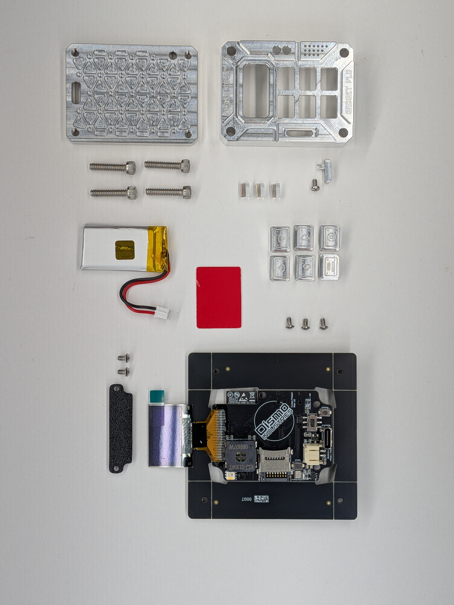

## 1

Part of offering the Cyber Fidget as a kit is that it allows people to get to know what they've bought a little better and instill that sense of ownership. With that said, the kit may not be for everyone, but if you're reading this guide, let's assume you've got some interest!

It's important to address a couple house keeping topics on assembling your Cyber Fidget. It has tiny parts that love to roll away or be tricky to see while assembling. While a lot of effort has been taken to make it as enjoyable as possible (e.g. the creation of this guide), it is important that you uphold your part of the deal of signing up for assembling a kit. This means have a clean, well lit, non-scratching, flat surface. A piece of printer paper is a great surface.

Set aside some time. Recognize that most pieces are supposed to fit together smoothly, with minimal force. A motto to keep is if it feels weird, it's probably wrong - so double check the guide or contact us if you're unsure.

While it's very appreciated you're excited about assembling the kit, please don't try to assembly it in your car or at a restaurant table. Please don't try to rush assembly. Trust us, it's a lot more enjoyable to dedicate some time and space and consider the assembly a unique, one-time experience as a part of the ownership. Unintentionally losing or breaking a piece is no way to have fun. But stuff happens, so please reach out if something doesn't go right!

Parts

1 - Case Back 2 - Case Front 3 - Socket Head Cap Screws (4x, #6-32 x 5/8in) 4 - Front Case Lenses (x2, longer) 5 - Back Case Lens (x1, shorter) 6 - Philips Head (1x, #2-56 x 5/32in) 7 - Slider 8 - Battery 9 - Color Filter (pick your favorite) 10 - Buttons (2x left/right, 2x up/down, 1x lines, 1x circle 11 - Button Head Screws (3x, #2-56 x 5/32in) 12 - Button Head Screws (2x, #2-56 x 5/32in) 13 - Screen Retainer 14 - Mainboard

Tools 0.050 Allen Key Philips #0 Screwdriver Tweezers (Optional)

  
  

    
  

