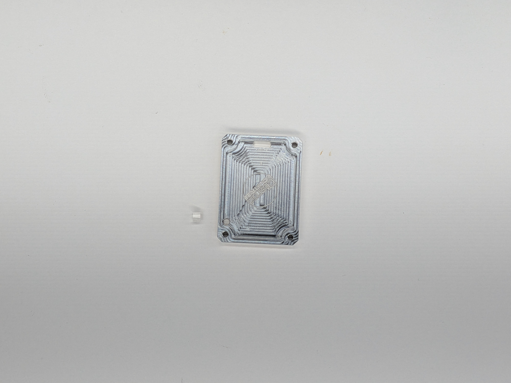
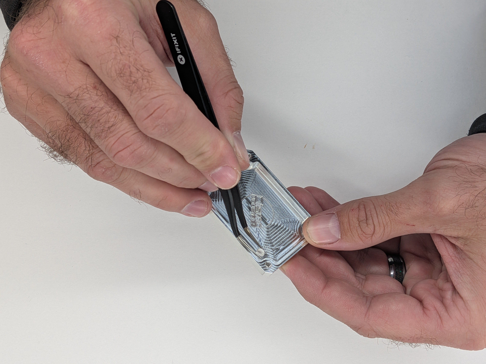

## 10

Gather: (1) Case Back, (2) Lens (1x, shorter) Optional: The lens helps diffuse the light, but if you want to use your Cyber Fidget as a flashlight, some of the brightness will be diminished with this lens.

1 - Align the lens as on the Case Front and press it into the Case Back (3)

  
  

    
    
  

