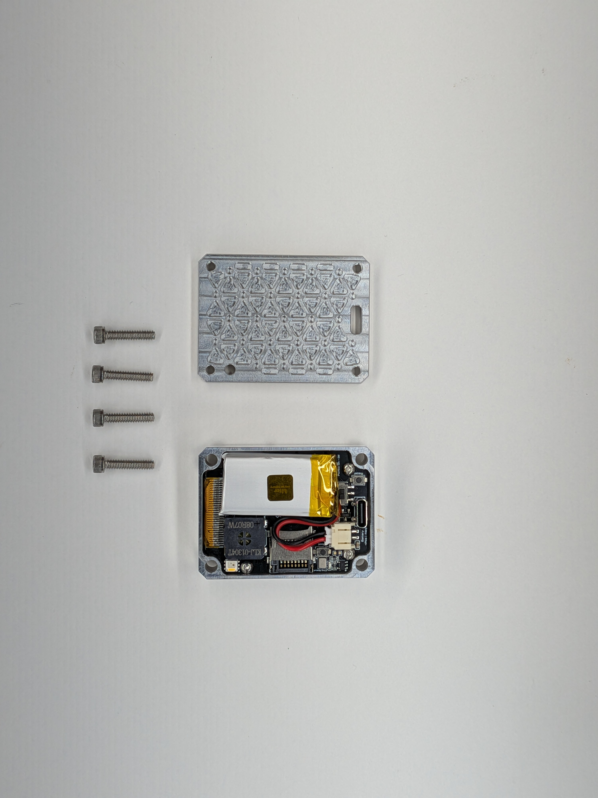
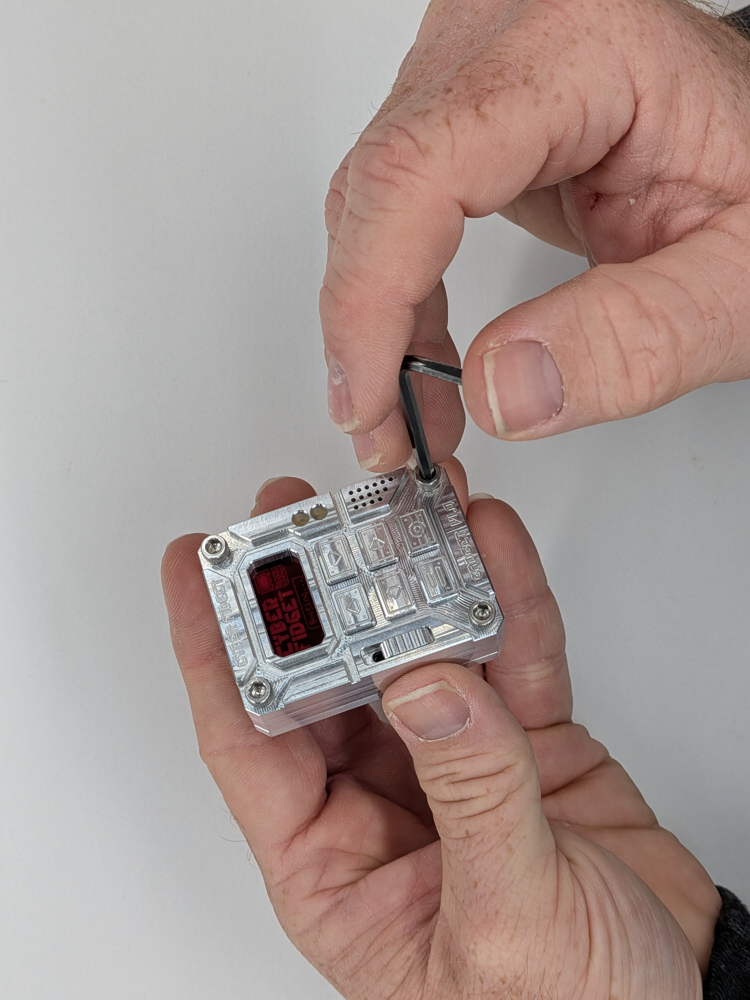
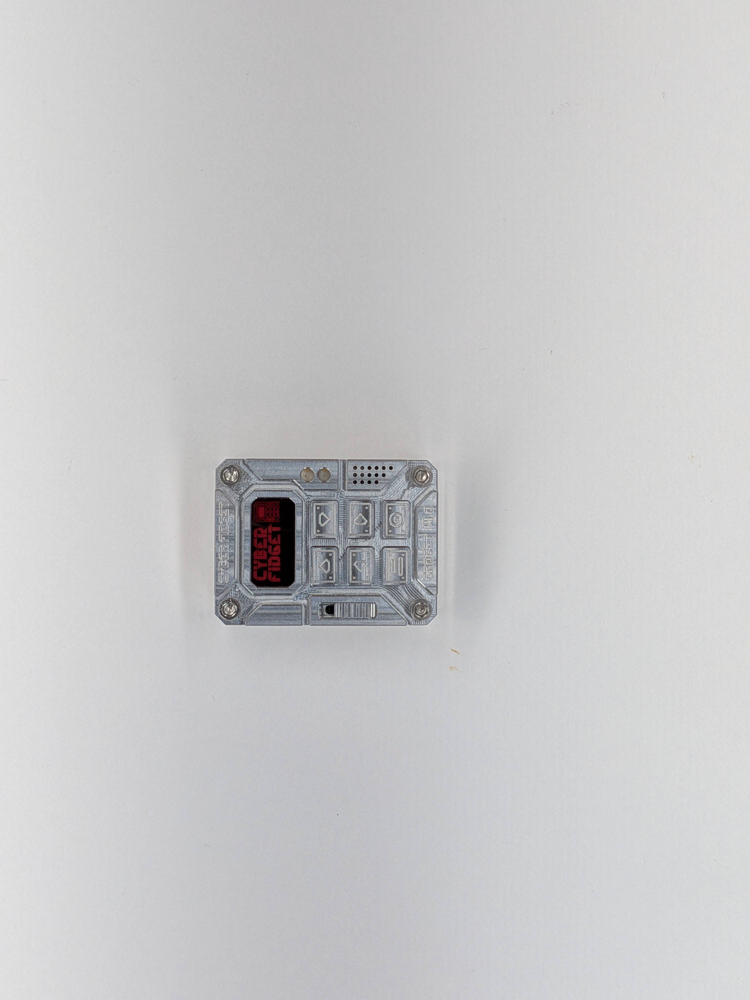

## 11

Gather: (1) Case Front, (2) Case Back, (3) Socket Head Cap Screws (4x, #6-32 x 5/8in)

1 - Align the Case Back to the Case Front. It's important to check this first fitment for battery clearance and wires until everything takes a set from being assembled. The two halves should have no gap and able to be cleanly aligned. 2 - Install the Socket Head Cap Screws. If you plan to take your Cyber Fidget apart frequently, you may finger tighten them. Otherwise, you can snug them with an allen key (4).

3 - Congratulations on assembly your Cyber Fidget :) (5)

  
  

    
    
    
    
  

