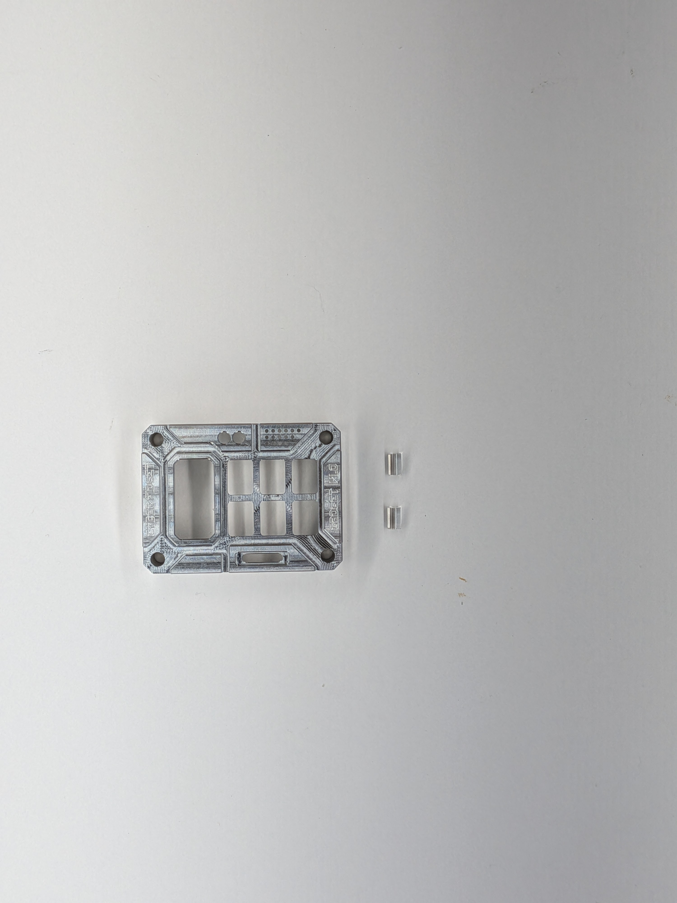
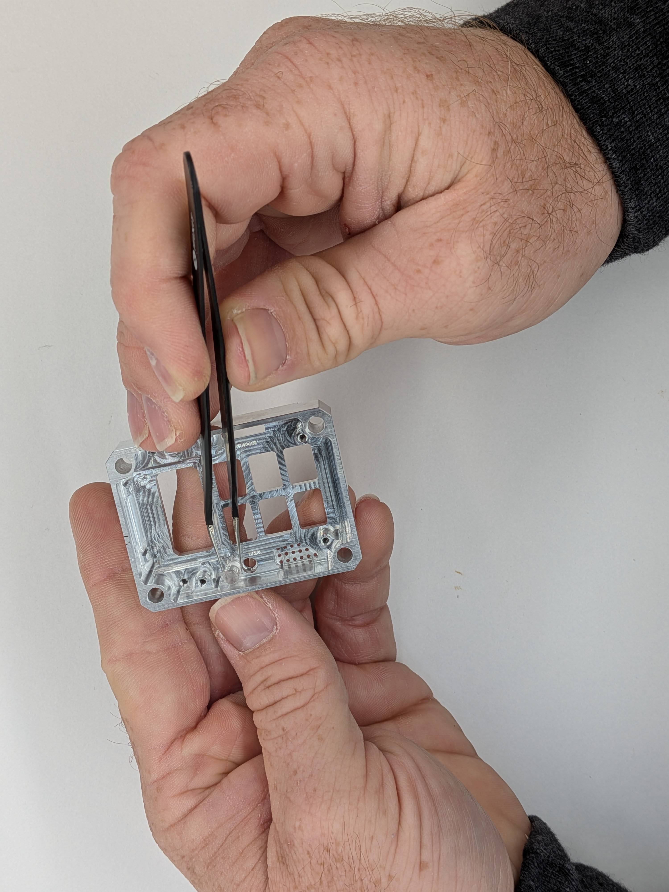
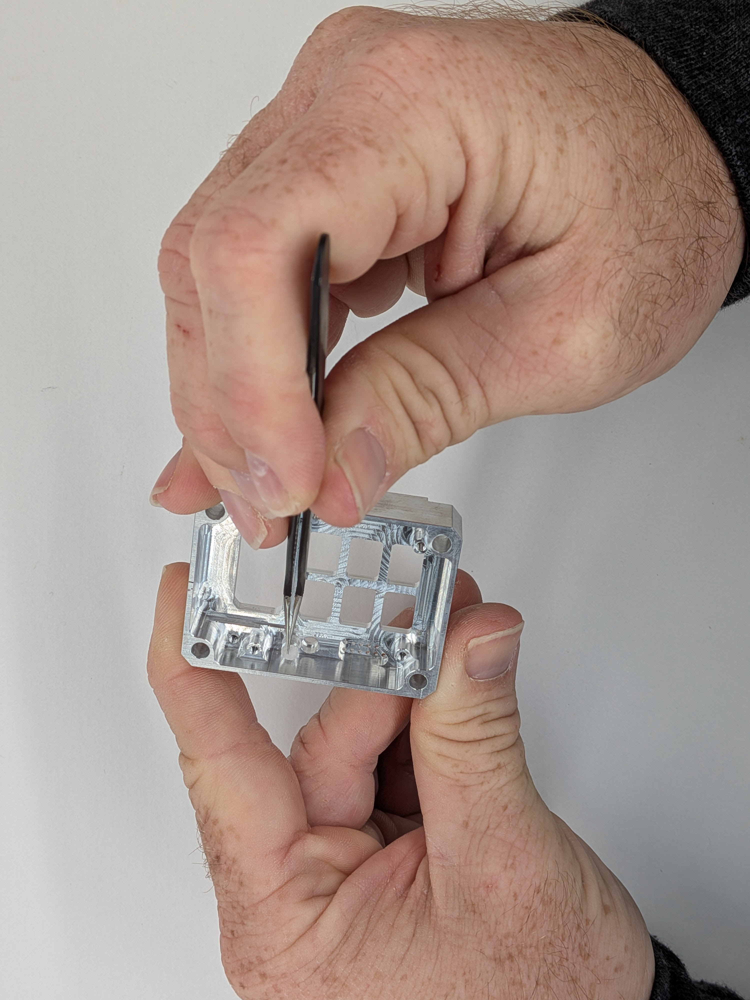
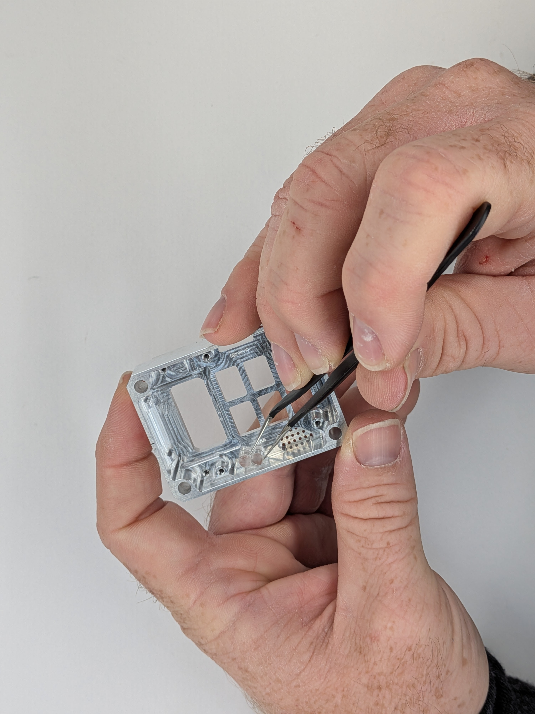
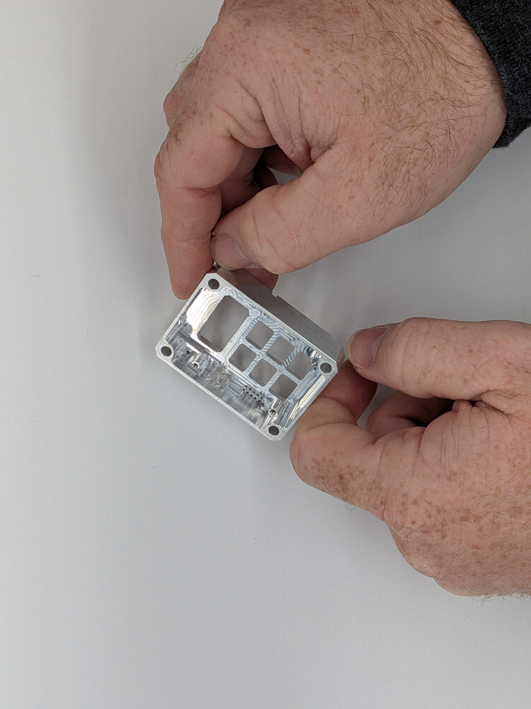

## 2

Gather: Case Front, Front Lenses (Longer of the set)

1 - Carefully align the lens to the lens bore. It is a precise slip fit to avoid having to use glue during assembly.  2 - Use fingers or tweezers to get the lens started, then firmly, but carefully press the lens until it bottoms out. You may use a soft blunt object like the backside of a pencil to aid pushing it in. 2 - Repeat for the second lens

⚠️ If you attempt to push the lens in crooked, it will create a burr on the side of the acrylic lens and make it more difficult to push in. Take care not to jam the lens into the bore without getting it aligned first. It shouldn't affect the optical properties if a tiny burr occurs, but it will be more difficult to assemble.

  
  

    
    
    
    
    
  

