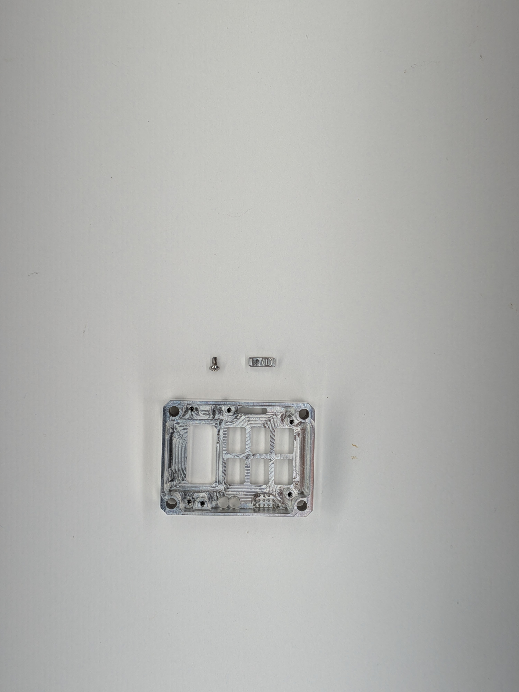
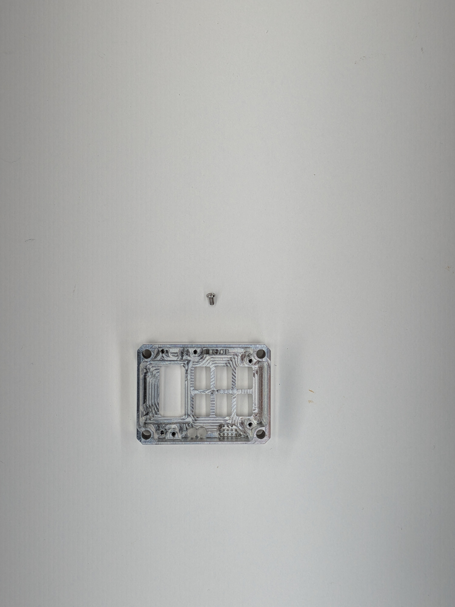
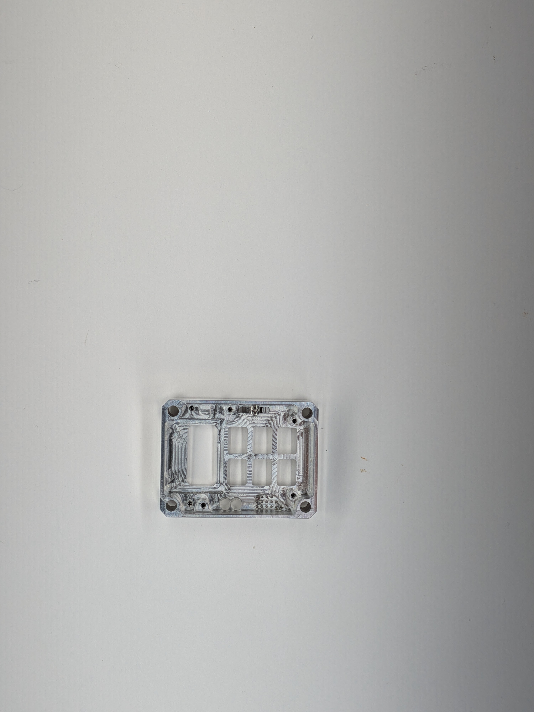
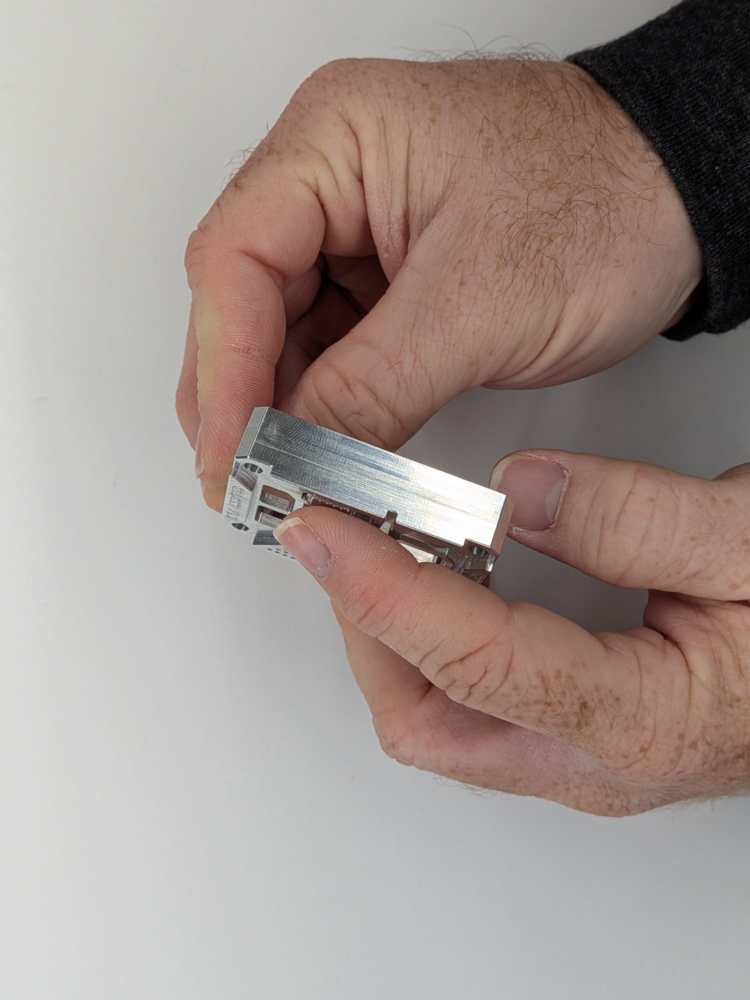

## 3

Gather: (1) Case Front, (2) Slider, (3) Philips Head (1x, #2-56 x 5/32in)

1 - Insert the slider into the front of the case, with the fork at the bottom side of the case (4) and the threaded hole towards the top (5). Make sure it feely moves. 2 - Using a small Philips Head Screwdriver, insert the screw into the slider and tighten until snug and the slider is still free to move (6).  3 - Test for excessive rattling by tapping the front face of the slider with your index finger while slowly tightening (7).

ℹ️ After the screw is mostly in, you will only be doing very small turns as the screw bottoms into the threads intentionally. The screw is meant to be snug to avoid backing out without threadlocking compound. ℹ️ The rattling will not completely go away with this test unless the slider is too tight. In normal use, this rattling does not exist due to how constrained the slider is in the pocket.

  
  

    
    
    
    
  

