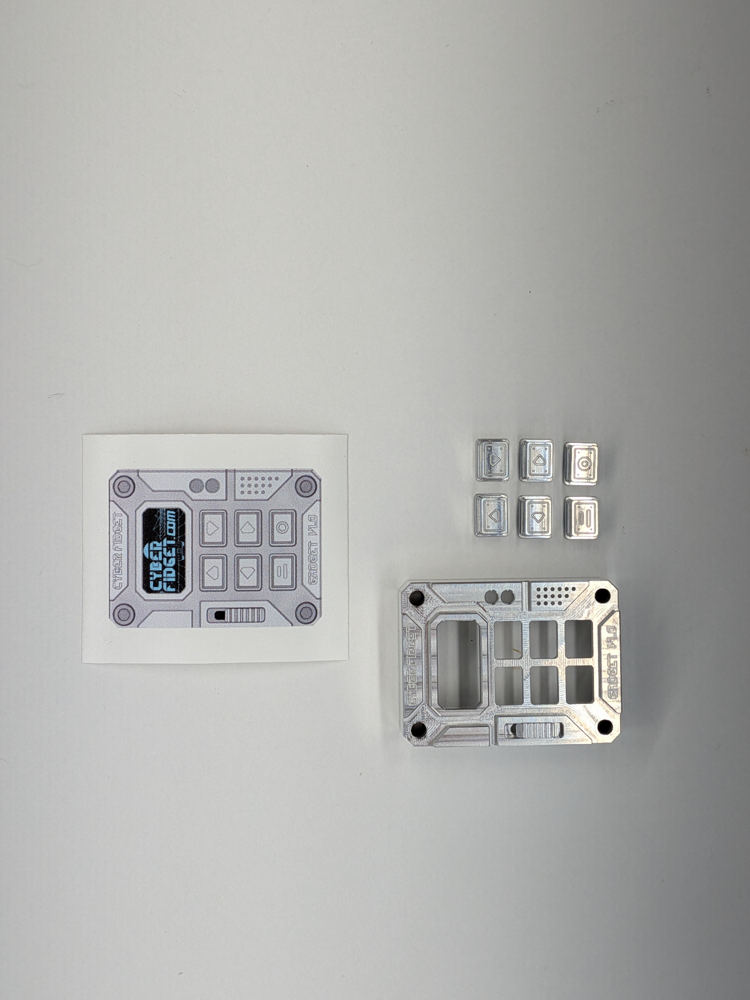
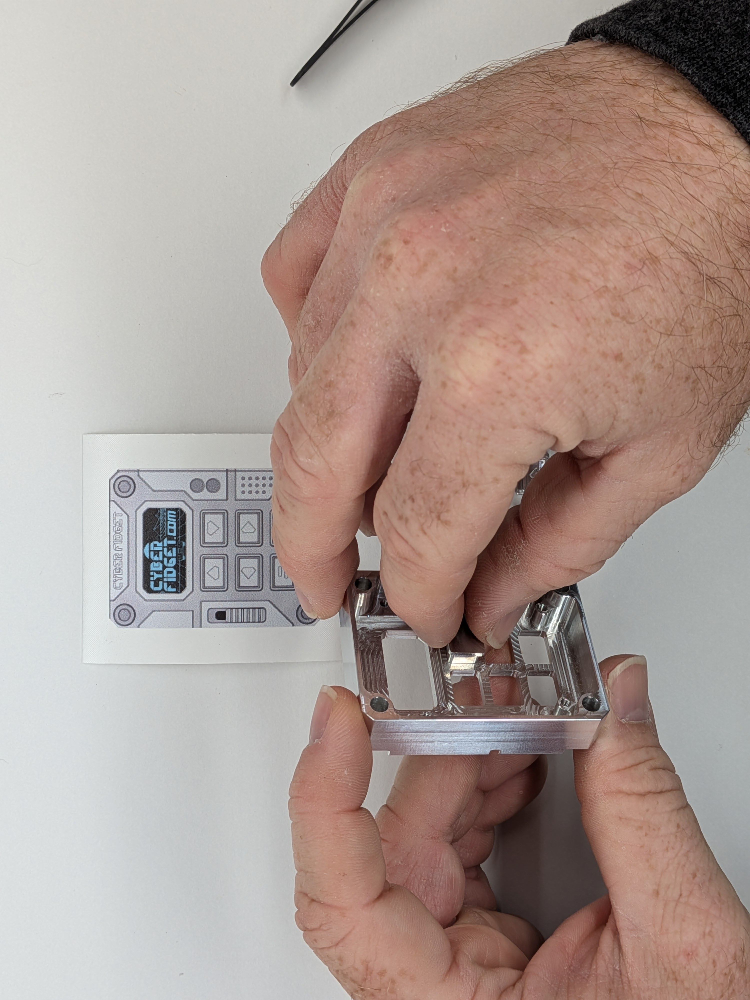
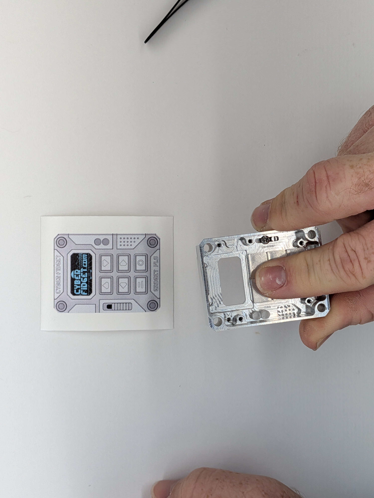
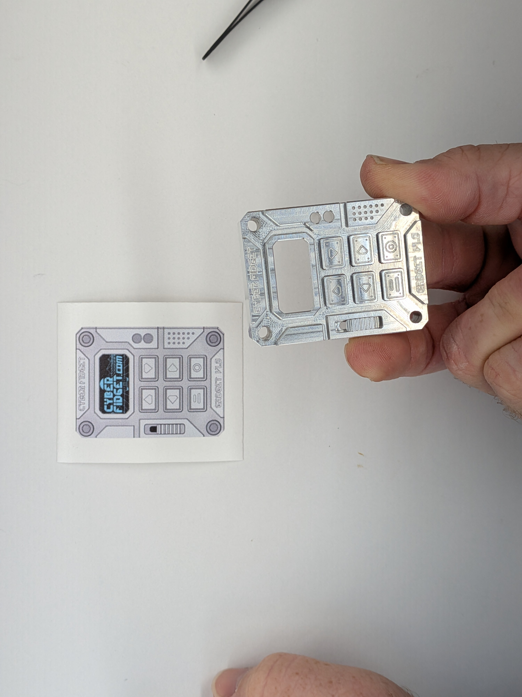

## 4

Gather: (1) Case Front, (2) Buttons, (3) Reference Layout

1 - Using the Reference Layout (unless you want to reprogram the button layout), insert the buttons into the Case Front. The buttons and case have a reasonably close fit to reduce rattling, and will require0 inserting them perpendicularly (4). There should be very little, if at all, force involved.

ℹ️ (5) You can you use your fingers to hold the buttons in while you flip the case over to see if it matches the layout you want. ℹ️ (6) For extra fun after assembly, you can fill the grooves with your choice of paint to add extra contrast. Acrylic paint pens work reasonably well and are very affordable.

  
  

    
    
    
    
  

