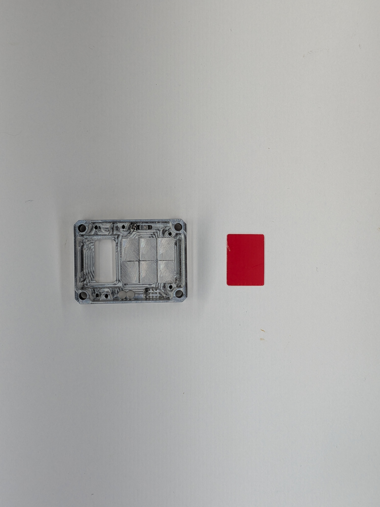
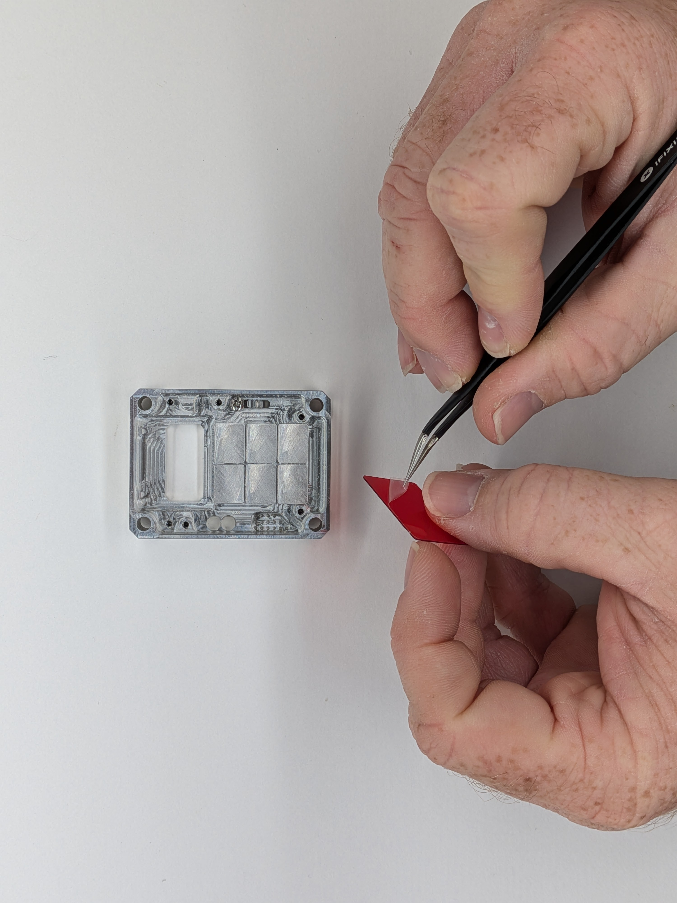
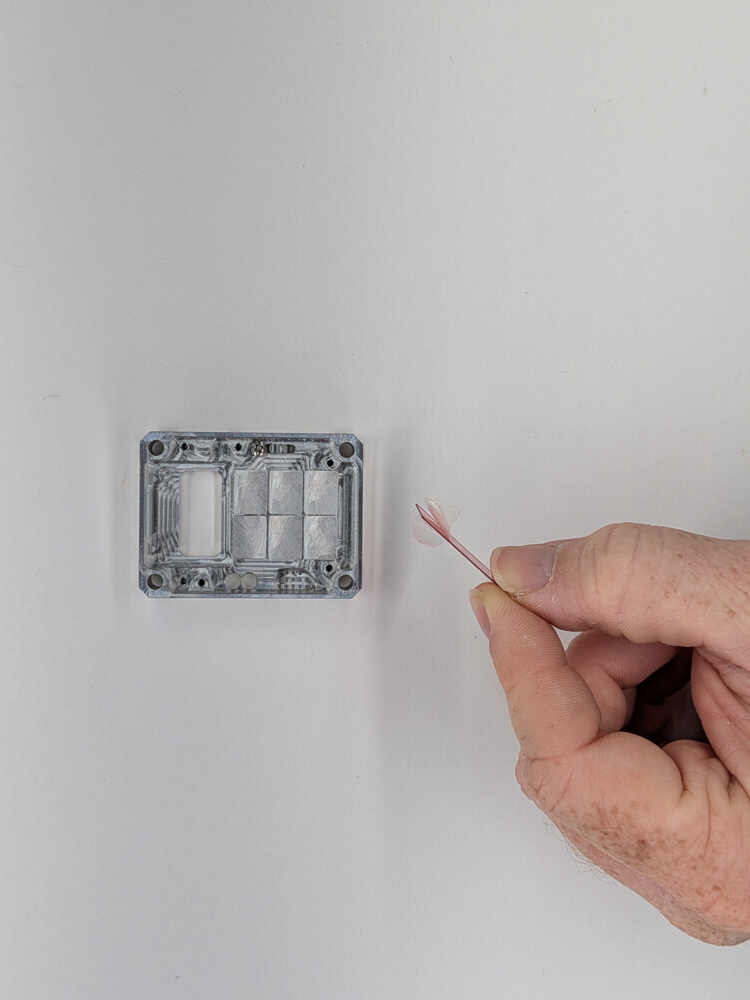
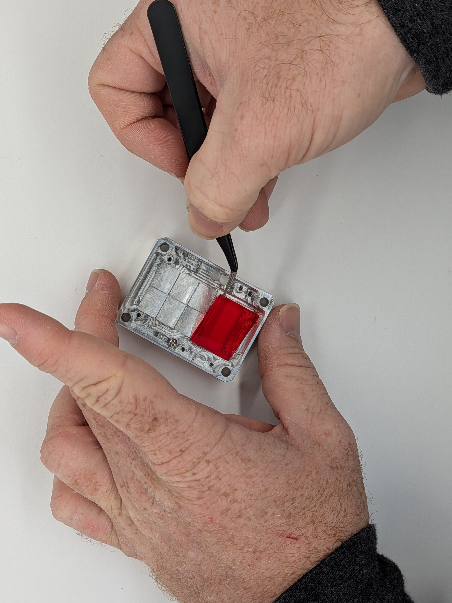
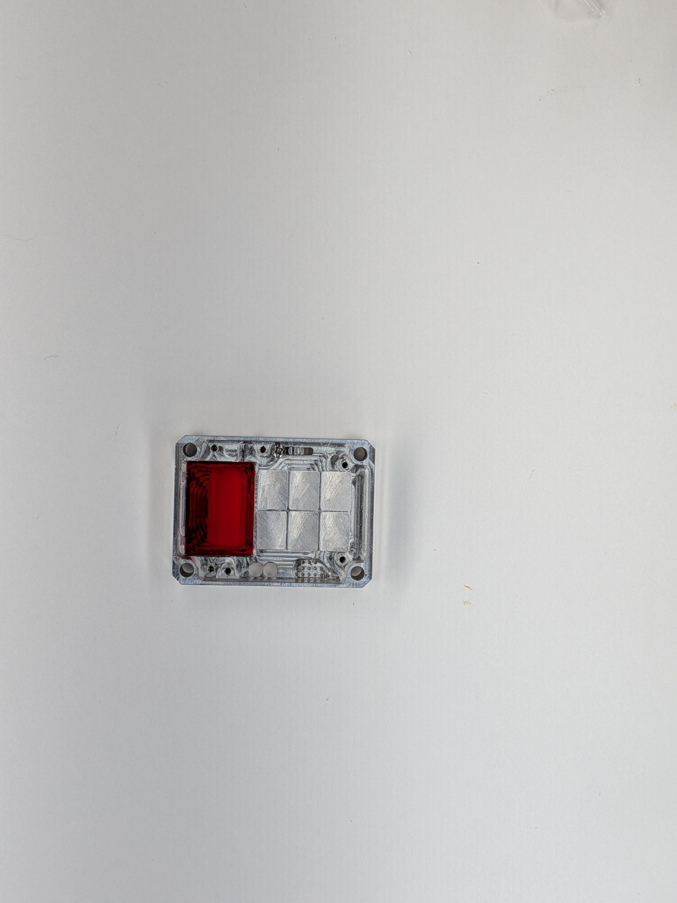

## 5

Gather: (1) Case Front, (2) Color Filter

1 - Grab tweezers or wash your hands 2 - Carefully holding the Color Filter to avoid fingerprints, remove the protective film 3 - Remove the film from the other side of the filter 4 - Insert the filter into the Case Front pocket over the screen window

ℹ️ Don't forget to remove the film from both sides of the color filter or nearly the entire Cyber Fidget will have to be disassembled.

  
  

    
    
    
    
    
  

