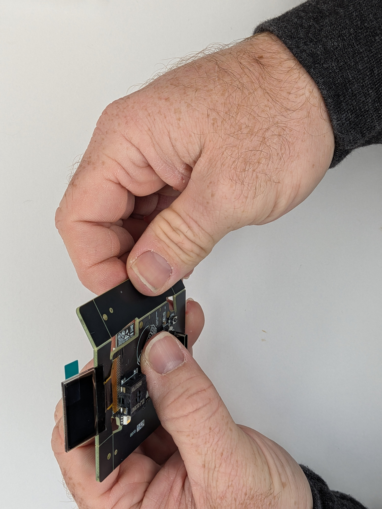
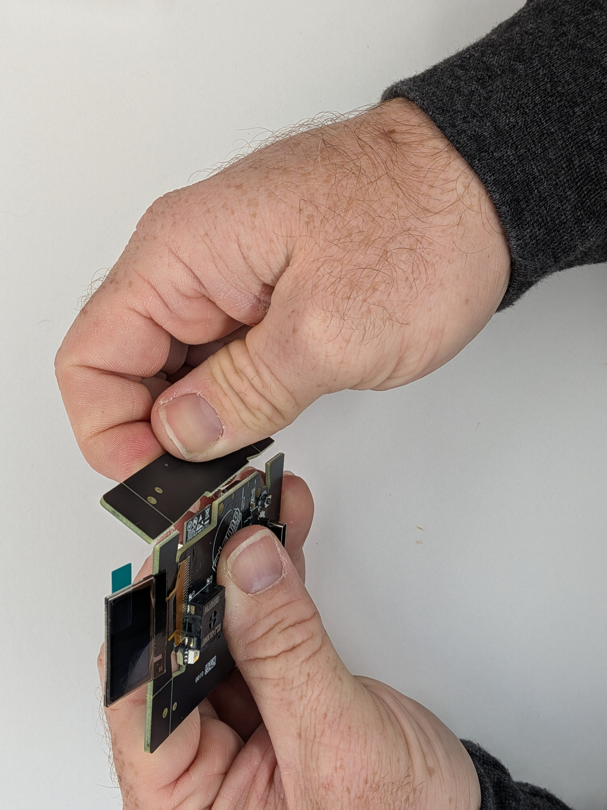
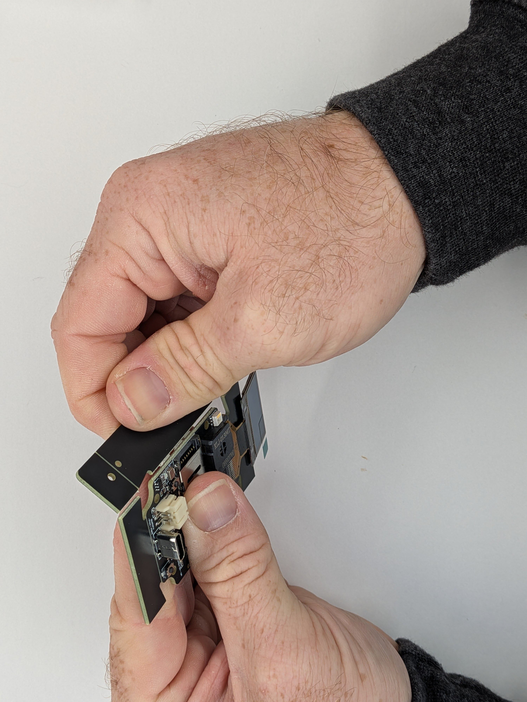
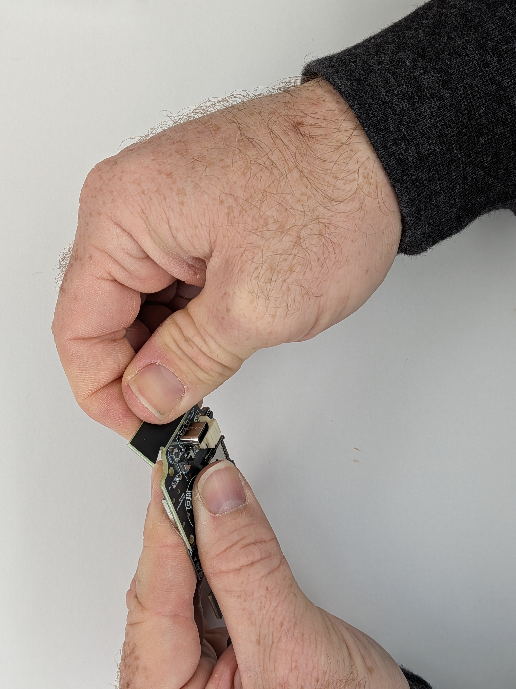
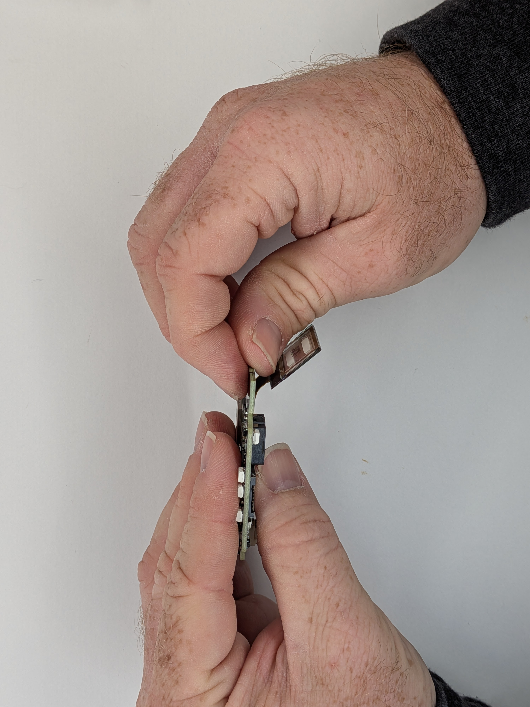
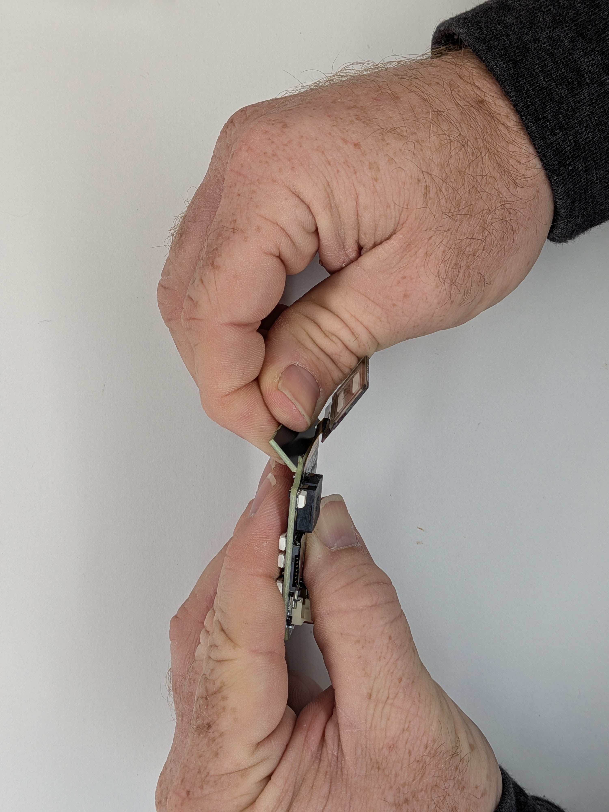

## 6

Gather: (1) Mainboard

ℹ️ If your mainboard arrives with extra support material, it is necessary to snap it off. As one final part of the manufacturing process, the circuit board has a groove cut into it to make removing the extra material easy.

⚠️ Be careful of the OLED screen and it's ribbon cable. The screen itself is fragile glass that it easily chipped and the flex cable is easily torn. 1 - Hold the mainboard in your non-dominant hand, grasping it confidently between your thumb and index finger (1).

Your thumb will be able to sit on the flat part of the board with the logo and your index finger on top of the buttons.

The screen should be on the same side as you (2) 2 - Grab a rail opposite of your hand and slowly bend the board away from you (3). It's okay to wiggle back and forth and eventually snap it off (4). 3 - Rotate the board 180 degrees and snap the opposite side off the same way, again being mindful not to snag the screen or rub on components (5). Snap it off (6). 4 - Then repeat the same for the piece near the USB-C connector (7). 5 - Then repeat for the piece remaining under the screen. The cable can be flex away as shown and be sure not to catch or interfere with it more than is necessary. It should snap away from the screen (9)

ℹ️ If any excess fibers or roughness is on the sides of the board, light sanding with a nail file or fine sandpaper can clean it up, but this generally shouldn't be needed. It is a composite material, so be mindful of the dust if sanding.

  
  

    
    
    
    
    
    
    
    
  

