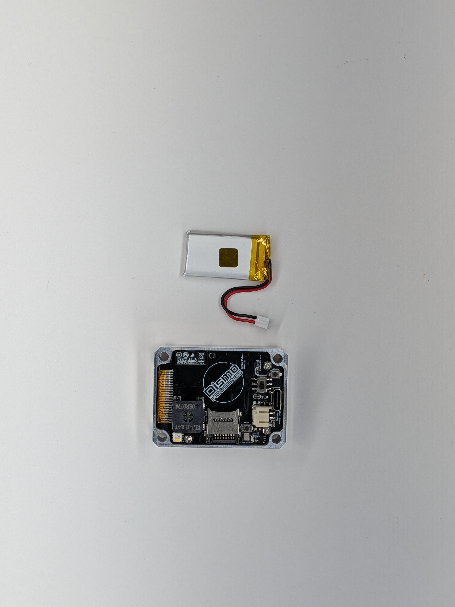
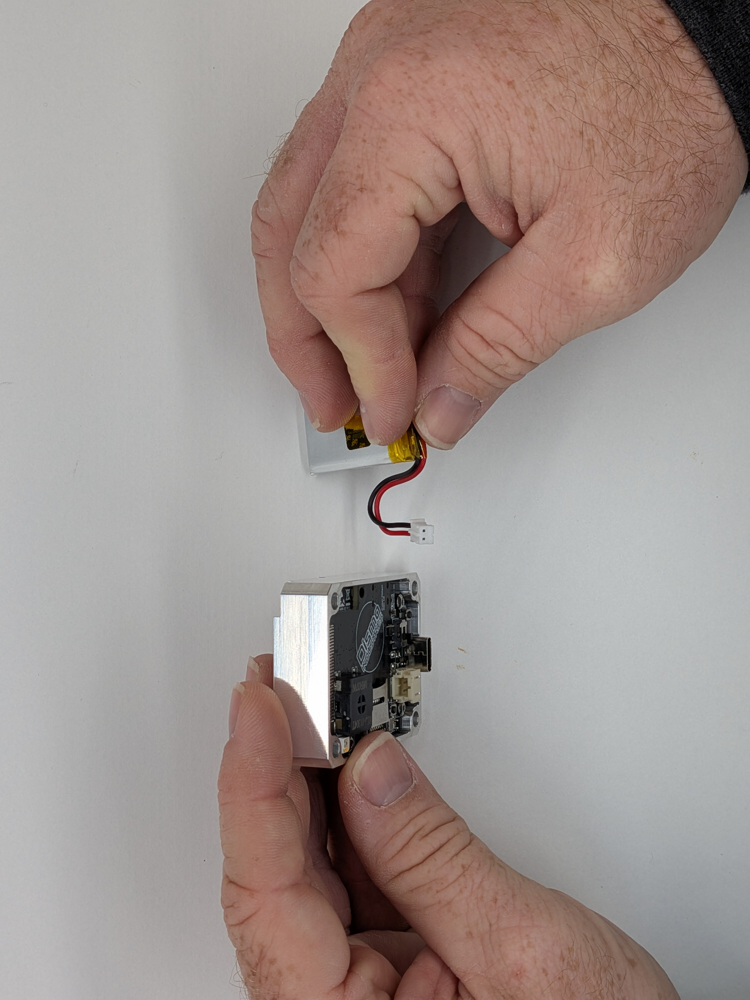
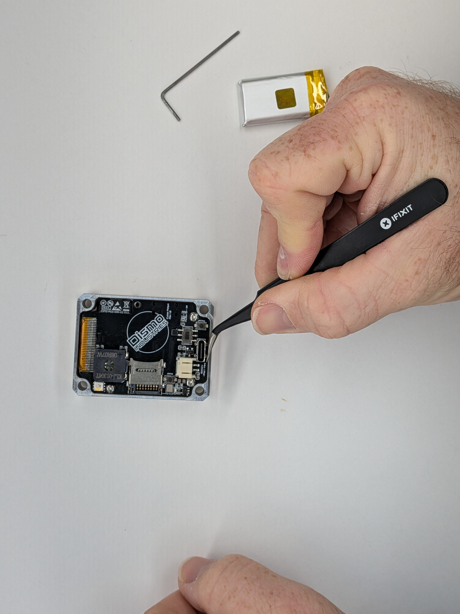
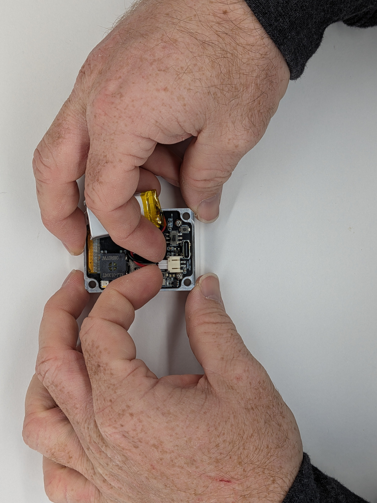
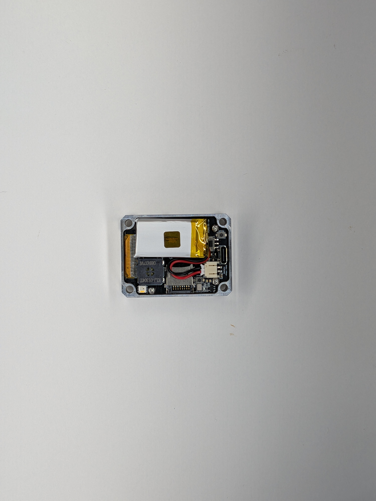
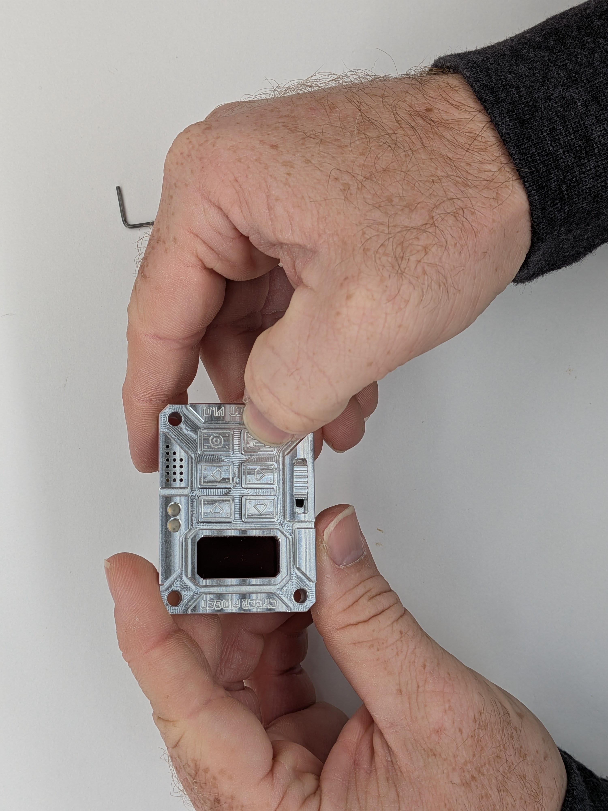

## 9

Gather: (1) Case Front, (2) Battery 1 - Inspect the battery connector (3) and the Mainboard battery connector (4) for orientation and wire polarity. The connector is keyed and only fits one way. Double check that + POS labeled on the Mainboard (5) will align with the red wire.

2 - Align the connector keys and using both index fingers and your thumbs to leverage the case, check to make sure the connectors are straight, then push the connectors together. It will be a tight fit.

3 - Route the wires as shown (6) and check to make sure the battery corner is not going to be pinched by the case. It is possible to lightly bend the the corner of the battery in if it is protruding excessively.

4 - Flip the Battery Disconnect Switch (8) to On and check that your Cyber Fidget powers up (9) and the screen looks correct. ℹ️ If your Front Case and/or Mainboard has a hole at location (6), do NOT insert a screw here. It is not necessary. ℹ️ If you ever want to store your Cyber Fidget long-term or avoid having it sit at full charge (e.g. when constantly plugged in), flip the power switch to off and it fully isolates the battery. Your Cyber Fidget will still power on just fine over USB-C power only.

  
  

    
    
    
    
    
    
  

