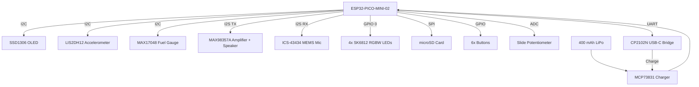

# Hardware Specs

!!! note "PCB rev 1.x"
    Specs reflect the current production revision (PCB rev 1.2). Minor physical changes may occur within the 1.x series; any compatibility-breaking changes will increment the major revision.

---

## Quick specs

ESP32 dual-core MCU · 0.96" OLED · 6 buttons + slider · 4 RGBW LEDs · speaker + mic · microSD · USB-C · machined aluminum · 2.2 x 1.6 x 0.8 in · ~68 g

---

## Full specifications

| Category | Detail |
|----------|--------|
| **Microcontroller** | ESP32-PICO-MINI-02 dual-core MCU, Wi-Fi 2.4 GHz 802.11 b/g/n, Bluetooth Classic + BLE |
| **Display** | 0.96" 128x64 monochrome OLED (SSD1306 family) |
| **Audio** | MAX98357A digital I2S amplifier with on-board speaker; ICS-43434 MEMS microphone |
| **Motion** | LIS2DH12 3-axis accelerometer |
| **Lighting** | 4x SK6812 RGBW LEDs (3 front, 1 back) + 1 red indicator LED |
| **Power** | 400 mAh LiPo battery, MAX17048 fuel gauge, MCP73831 charge controller, swappable battery pack. Hours of active time, weeks of standby/deep sleep |
| **Storage** | microSD card slot (FAT32) for app storage and file browsing |
| **Connectivity** | USB-C port with CP2102N USB-to-UART bridge (serial + charging) |
| **Inputs** | 6x tactile buttons + 1 analog slide potentiometer, hardware RC debounce + firmware debouncer |
| **Voltage regulation** | 3x AP2112K-3.3 LDO regulators (main logic, OLED, LEDs/peripherals) for fine-grained power control |
| **Dimensions** | 2.2 x 1.6 x 0.8 in (55.3 x 41.3 x 19.6 mm) |
| **Weight** | ~68 g (varies by backplate design) |
| **Enclosure** | Precision-machined aluminum chassis with replaceable backplate. 3D-printable models available |
| **Assembly** | Ships as a kit — no soldering, just screws. Designed for repairability and customization |
| **Development** | Arduino (ESP32); best experience with VS Code + PlatformIO (via pioarduino). CircuitPython hardware support designed-in but currently untested |

---

## Block diagram

---

## Power architecture

Three independent AP2112K-3.3 regulators allow the firmware to selectively power down subsystems for low-power modes:

| Regulator | Rail | Supplies |
|-----------|------|----------|
| Main | 3.3V | ESP32 MCU |
| OLED | 3.3V_OLED | SSD1306 display (GPIO 12 enable) |
| AUX | 3.3V_RGB | SK6812 LEDs, audio amp, mic, slider, SD card, provisional hall sensors (GPIO 2 enable) |

---

## See also

- [Pinout reference](pinout.md) — GPIO assignments and I2C addresses
- [Concepts](../concepts/index.md) — How to use each hardware feature in code
- [Assembly guide](../getting-started/assembly/guide.md) — Build your device step by step
- [Accessories](../product/accessories.md) — Color gels, backplates, and 3D printing
