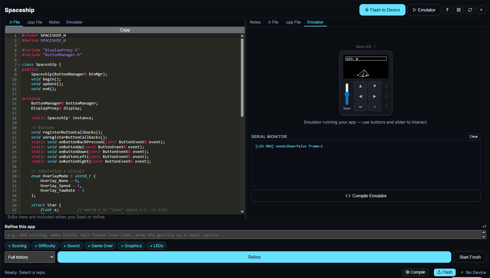
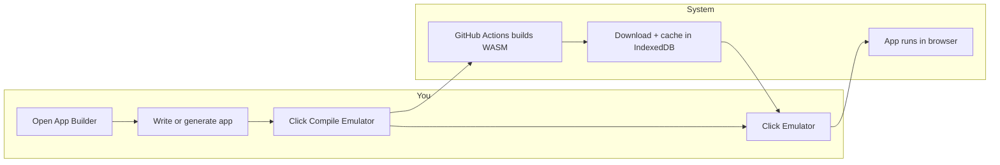
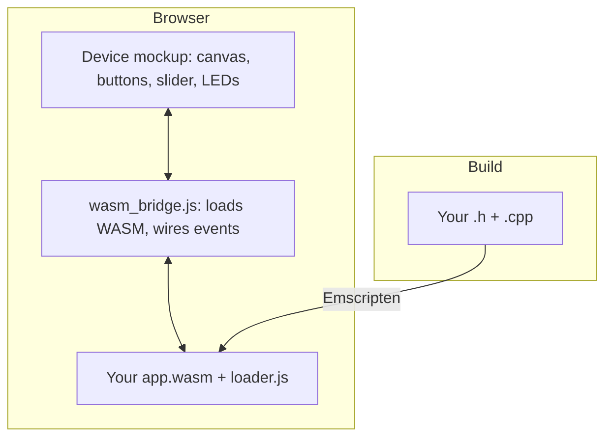
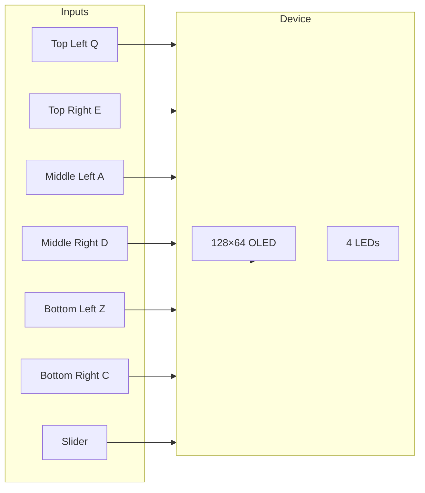
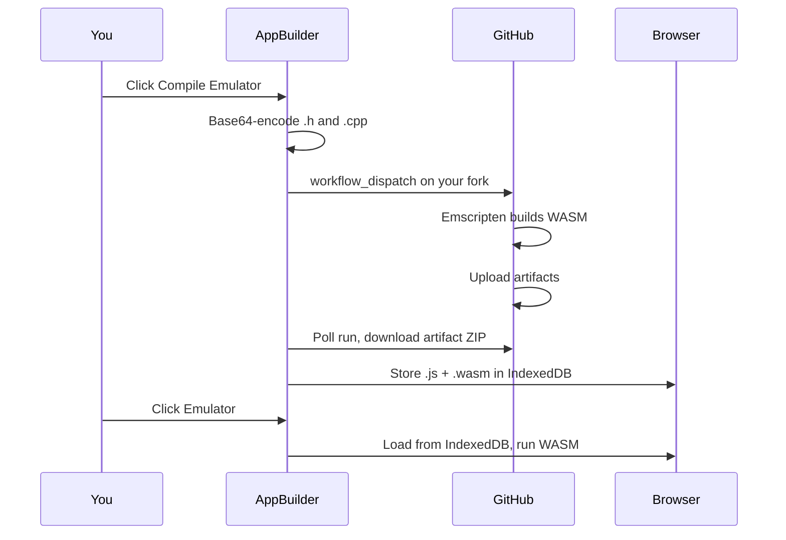

# Browser Emulator

The Cyber Fidget browser emulator lets you **run real app code directly in your browser** — no hardware required. It compiles your C++ app to WASM and maps every hardware feature (OLED, buttons, slider, LEDs, audio) to browser equivalents.

!!! tip "Who is this for?"
    - **App developers**: Test your code instantly without flashing a device
    - **Newcomers**: Try Cyber Fidget apps before buying hardware
    - **App Builder users**: See your generated app running in seconds

---

## Where to find it

The emulator lives inside the **App Builder** at [cyberfidget.com/build](https://cyberfidget.com/build). Use the action bar to **Compile Emulator** (builds your code to WASM) and **Emulator** (runs the last build from cache).

!!! example "Screenshot"
    

---

## Quick Start

### 1. Open the App Builder

Go to [cyberfidget.com/build](https://cyberfidget.com/build) and sign in with GitHub.

### 2. Write or Generate an App

Use the wizard to generate an app, import an existing one, or write code directly in the editors.

### 3. Compile

Click the **Compile Emulator** button below the serial terminal. This sends your code to GitHub Actions on **your own fork** of the firmware repo, compiles it to WASM, and downloads the result. Takes about 1–2 minutes the first time.

!!! info "First time setup"
    You need a GitHub account and a fork of the CyberFidget firmware repo. The App Builder walks you through forking automatically when you sign in.

### 4. Run

Click the **Emulator** button (play icon) in the action bar. Your app loads from cache and runs immediately.

---

## How the emulator fits together

The on-screen device (OLED, buttons, slider, LEDs) is driven by the same C++ app that would run on real hardware. The HAL (Hardware Abstraction Layer) is swapped for browser APIs so no ESP32 is involved.

---

## Emulator Controls

The emulator mimics the physical Cyber Fidget layout:

| Physical Control | Emulator Equivalent | Keyboard Shortcut |
|---|---|---|
| Top Left button | Click Top Left button | `Q` |
| Top Right button | Click Top Right button | `E` |
| Middle Left button | Click Middle Left button | `A` |
| Middle Right button | Click Middle Right button | `D` |
| Bottom Left button | Click Bottom Left button | `Z` |
| Bottom Right button | Click Bottom Right button | `C` |
| Slider (potentiometer) | Vertical slider on the left | Drag |
| OLED display (128×64) | Canvas at top | — |
| 3 front LEDs + 1 back LED | Colored circles | — |

!!! example "Screenshot (optional)"
    Add a screenshot of the emulator device mockup with labels for OLED, buttons, slider, and LEDs. Save as `docs/assets/emulator/device-mockup.png`.

### Panel controls and hints

Above the device mockup you’ll see:

- **Try a built-in app** — Dropdown to load a pre-compiled app (Demo, Dino Game, Flashlight, Breakout, Matrix Screensaver) without compiling.
- **Shortcut hints** — Buttons: `Q` `E` `A` `D` `Z` `C`; tilt: move mouse. The **?** link opens the full [emulator docs](https://docs.cyberfidget.com/software/emulator/) (this page). Hover over each button in the mockup to see its key.
- **Volume** — Slider and mute let you turn down or mute the emulator’s *output* (so you’re not stuck at a fixed volume). The app’s own volume is unchanged; real volume control belongs in the app / on the device. The volume row glows green while the app is playing a tone.

**Compile** builds your current code to WASM; **Record GIF** captures the emulator screen as a 5-second GIF. Use **Load App** (in the action bar or next to New App) to switch or import an app; the emulator auto-loads the cached build when available.

### Serial Monitor

Below the emulator, a **Serial Monitor** panel shows any `Serial.println()` output from your app — useful for debugging.

---

## How Compilation Works

When you click **Compile Emulator**, the following happens:

1. Your `.h` and `.cpp` code is base64-encoded
2. A GitHub Actions workflow is triggered on **your fork** of the firmware repo
3. The workflow compiles your code with [Emscripten](https://emscripten.org/) (a C++ to WebAssembly compiler)
4. The compiled `.js` and `.wasm` files are uploaded as build artifacts
5. The App Builder downloads and caches them in your browser (using IndexedDB)

!!! note "Compilation runs on YOUR GitHub"
    Compiling uses your GitHub Actions minutes, not CyberFidget's. This keeps the service free and sustainable. Pre-built official apps are cached and don't require compilation. 

### Build Cache

- Compiled WASM is cached in your browser's IndexedDB
- Clicking **Emulator** loads from cache instantly — no recompilation
- Cache persists across page refreshes
- Clicking **Compile Emulator** always triggers a fresh build
- Clicking **Start Fresh** clears the cache

---

## What Works in the Emulator

| Feature | Status | Notes |
|---|---|---|
| OLED display (128×64) | **Full** | Pixel-perfect with real firmware font rendering |
| All 6 buttons | **Full** | Click or use keyboard shortcuts |
| Slider | **Full** | Maps to the same 0–4095 ADC range as hardware |
| RGBW LEDs (4) | **Full** | Colors rendered with glow effects; dim values boosted for visibility |
| Serial output | **Full** | Routed to the Serial Monitor panel |
| Audio/tones | **Full** | Web Audio API; panel has output volume/mute (browser only — app volume is unchanged); slider glows when app plays sound |
| Accelerometer | **Full** | Move mouse (desktop) or use device motion (mobile) for tilt |
| Battery level | **Stub** | Always reports 100% |
| WiFi | **Stub** | Not available in browser |
| Deep sleep | **Stub** | No-op (calls are safely ignored) |

---

## Tips

- **Test with keyboard shortcuts** — `Q/E/A/D/Z/C` for buttons is faster than clicking (hints appear in the panel and on button hover).
- **Tilt / accelerometer** — On desktop, move the mouse; on mobile, use device orientation when the browser provides it.
- **Watch the serial terminal** — If your app isn't behaving right, add `Serial.println()` calls for debugging
- **LED values are boosted** — The emulator scales up dim LED values (below brightness 50) so they're visible on screen. On real hardware, even brightness 3/255 emits visible light, but `rgb(0, 3, 0)` on a dark background is invisible
- **The slider is inverted** — This matches the physical device orientation

---

## Troubleshooting

### "No build found. Click Compile first."
You haven't compiled yet, or the code changed since the last compile. Click **Compile Emulator**.

### Compilation takes too long (>5 minutes)
Check your fork's **Actions** tab on GitHub. The workflow may have failed or be queued behind other jobs. If the run failed, open the run and read the log for errors (e.g. missing `wasm/` directory, CMake or Emscripten errors).

### "Sign in to GitHub to compile your app"
The emulator needs a GitHub token to trigger compilation on your fork. Sign in using the GitHub button in the top right. If you're already signed in, try signing out and back in; the token may have expired.

### Workflow fails with "wasm/CMakeLists.txt not found"
Your fork may be out of date or missing the WASM build files. Sync your fork with the upstream CyberFidget firmware repo so that the `wasm/` directory and `.github/workflows/compile-wasm.yml` exist.

### Artifact download fails or "Failed to fetch artifact"
GitHub Actions artifacts are only available for a limited time after the run. If you waited too long, run **Compile Emulator** again. If it fails immediately, check your network and that GitHub isn't blocking the request (e.g. corporate firewall).

### App compiles but doesn't run / blank screen
- Open the browser dev tools (F12) and check the **Console** for errors (e.g. "CyberFidgetModule is not a function", WASM compile errors).
- Ensure your app has proper `begin()` and `update()` methods and that the app is selected correctly in the build (e.g. custom app name matches).
- Try **Start Fresh** and then **Compile Emulator** again to clear a bad cache.

### App compiles but doesn't behave right
- Check the Serial Monitor for `Serial.println()` output or error messages.
- The emulator runs at 50 FPS — same as the real device; timing should match.
- If only some features fail (e.g. display works but LEDs don't), see the [Emulator Dev Guide](../contribute/emulator-dev.md) for known HAL behavior.

### LEDs appear dim or the wrong color
LED channel behavior in the emulator matches the firmware's Adafruit NeoPixel shim (WRGB packing). If colors look different from hardware, the firmware's RGBController may have intentional channel adjustments for the specific LED hardware on the device.

### "CORS" or "file://" errors when loading WASM
WASM cannot be loaded from `file://` URLs. You must use the App Builder on the live site (or a local HTTP server). If you're building WASM locally, serve the built files over HTTP and load them via the site's "Load from file" option if available.

### Buttons or slider don't respond
Make sure the emulator panel has focus or click once inside it. Keyboard shortcuts (Q/E/A/D/Z/C) only work when the page (or the emulator area) has focus. If you're on a tablet or phone, use the on-screen buttons.

### Serial Monitor is empty
Your app may not be calling `Serial.println()`. Add a line in `begin()` or `update()` to confirm the app is running. If you see output once then it stops, the app may have crashed or entered an infinite loop; check the browser console.

### Different browser or device: cache not there
The IndexedDB cache is per-origin and per-browser. Compiling on your laptop won't populate the cache on your phone or another browser. Run **Compile Emulator** on each device/browser where you want to run the app.

### I want to run completely offline
Right now compilation requires GitHub Actions (internet). For fully offline use, you need to build WASM locally with Emscripten and load the resulting files; see the [Emulator Dev Guide](../contribute/emulator-dev.md) (Local Development) and the follow-up plan for offline compilation.
