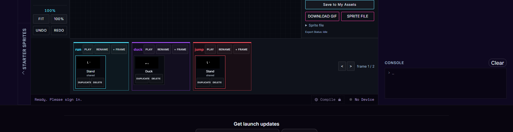

# Animation States

An animation state is a named sequence of frames for one action, such as `run`, `duck`, or `jump`. States let your app choose the right sequence while keeping related frames together in the Art editor.

---

## When the state strip appears

The state strip appears for a sprite that has two or more named animations, or for a sprite marked as the character type.

Each animation is shown as a labeled, colored group. Its frames appear inside that group. A frame used by more than one state has a **shared** badge, and frames that do not belong to any state appear in an **Unassigned** section at the end.

A simple sprite with one animation keeps the plain frame strip.

---

## Work with one state

Each state has its own controls:

- **Play** loops only that state, so you can preview its motion.
- **Rename** changes the state's label.
- **+ Frame** adds a frame directly to that state.

These controls keep state-specific editing local to the group you are working on.

---

## Find empty states

Your app's code can ask a sprite to play a state. If that state has no frames, a warning chip appears in the editor.

Add a frame to the state or update the app code so the requested state contains something to play.

---

## Set frame timing

Frame timing controls how long each frame remains visible. The default is 100 milliseconds (ms) per frame.

An animation frame set to 0 ms would not be visible. Studio reports a build warning when it finds one, so you can give the frame a visible duration before installing the app.

For saving and recovering edits to the underlying drawing, see [Drawing and version history](drawing-and-versions.md).
