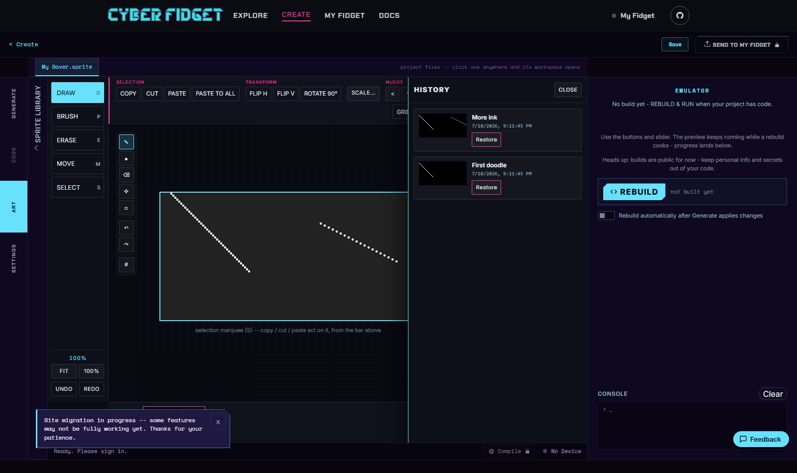

# Drawing and Version History

Every drawing in [Studio](https://cyberfidget.com/create/) keeps a version history. You can save a checkpoint yourself, and Studio also protects your work at important moments.

---

## Save a version yourself

Select **Save version** while you are drawing. You can add an optional label to help you recognize the version later.

Useful labels describe the change you just finished, such as `clean outline` or `jump pose`.

---

## When Studio saves automatically

Studio saves a version when:

- You switch away from a drawing that has changes
- Something is about to replace your art
- You start a build

You do not need to export a file before any of these actions.

---

## Read the History panel

Open the **History** panel to see the drawing's saved versions. The newest version is first. Each entry includes a small preview and a timestamp, so you can compare the versions before choosing one.

---

## Restore an older version

Choose **Restore** on the version you want. Studio makes that art current without deleting the version you were working on or any other history.

A new entry appears at the top of the list with a **restored** badge. This gives you a record of the restore and lets you keep working from that point.

If the version already matches your current art, Studio leaves the drawing unchanged and tells you: "That version is already current."

!!! tip "Restoring is non-destructive"
    Restoring adds to your history. It does not rewind the list or erase newer work.

---

## The 20-version limit

Each drawing keeps up to 20 versions. When the limit is reached, Studio removes older versions and shows a note explaining what happened.

If a version matters for a future edit, give it a clear label so it is easy to recognize while it remains in the history.
