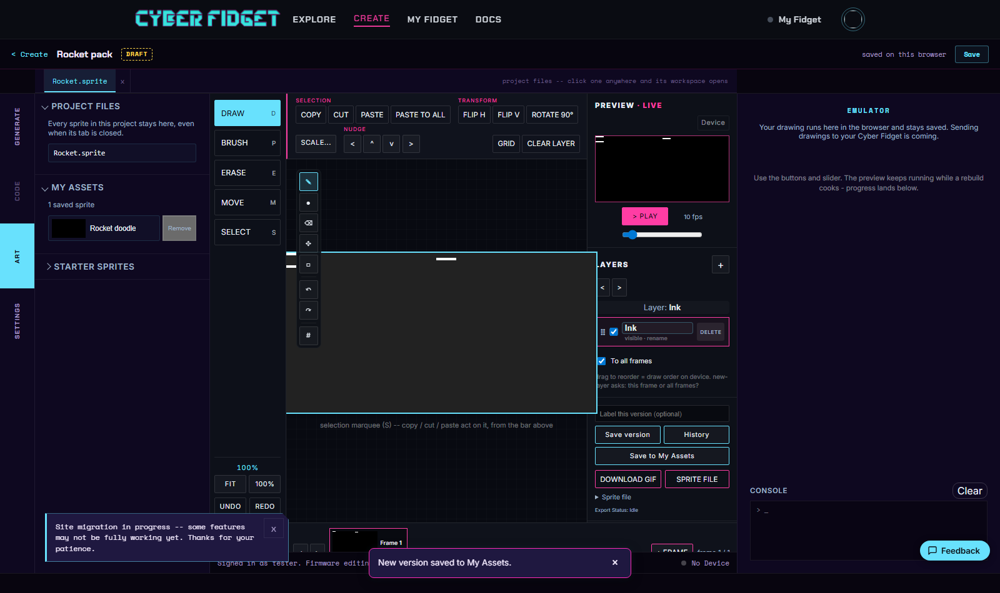

# Your Sprite Library

The Art panel's library rail helps you reuse sprites without tying the copies together. A sprite is an image or animation used by an app, often for a character, object, or effect.

The library has three scopes: **Project Files**, **My Assets**, and **Starter Sprites**.

---

## Project Files

**Project Files** lists every sprite in the project, including sprites whose editor tabs are closed.

Closing a tab only closes that editor view. It never deletes the sprite from your project.

---

## My Assets

**My Assets** is your account's sprite library. You must be signed in to use it.

To add a sprite:

1. Choose **Save to My Assets**.
2. Review or change the prefilled name in the in-page dialog.
3. Save the sprite.

Your account can hold up to 50 sprites. Saving another sprite with the same name does not overwrite the earlier one. It adds a new version under that name.

---

## Starter Sprites

**Starter Sprites** is the built-in Creative Commons Zero (CC0) collection. CC0 content can be reused without the usual copyright restrictions.

You can use a starter sprite in two ways:

- **Add to open sprite** combines the starter art with your current drawing as a new layer.
- **Copy to Project** adds the starter sprite to the project as its own sprite file.

---

## Copies stay independent

Using a sprite from any library copies it into your project. Editing the project copy never changes the library original.

A small note on the copy records where it came from. This helps you recognize reused art without creating a live link back to the source.

---

## Sprites travel with your app

Sprite files are part of the app project. When you build, Studio compiles your art into the app automatically. When you install the app on your device, its sprites go with it.

The complete flow is:

1. Author your app.
2. Draw its art in Studio.
3. Build the app.
4. Install the app on the device.

There are no sprite export or import steps between drawing, building, and installing.

For sprites with multiple actions, continue with [Animation states](animation-states.md).
